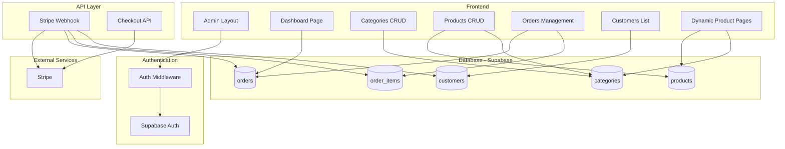
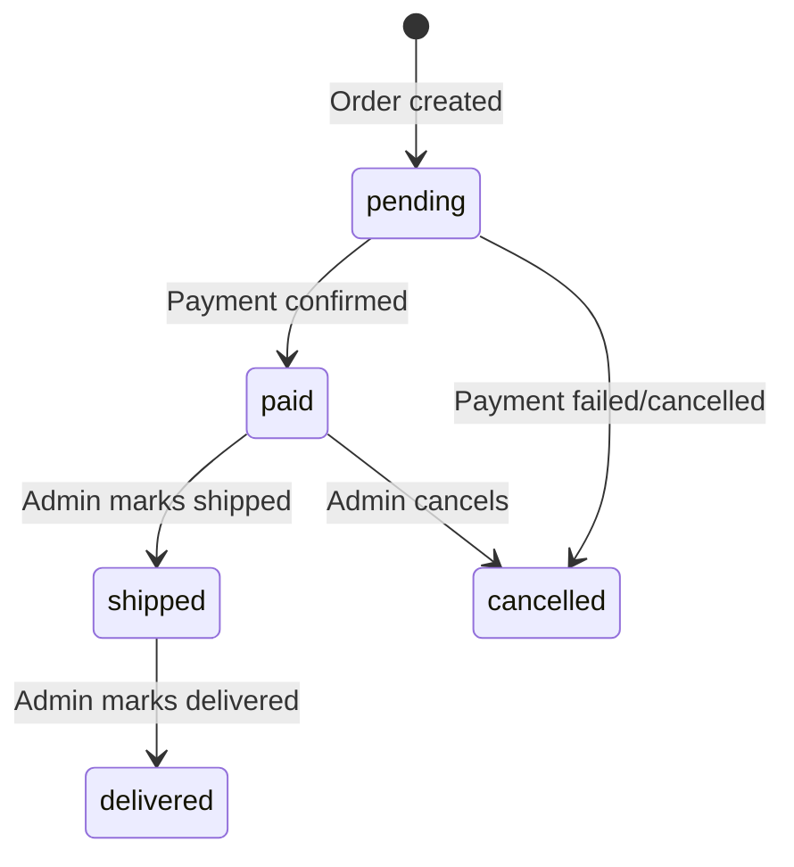

# Design Document: Admin Backend

## Overview

This design document describes the technical architecture for the Greenter e-commerce admin backend. The system extends the existing Next.js 16 application with a protected admin panel for managing products, categories, orders, and customers. It leverages Supabase for database storage and authentication, integrates with the existing Stripe payment flow, and provides dynamic product routing.

The architecture follows Next.js App Router conventions with server components for data fetching, server actions for mutations, and client components for interactive forms. The admin panel uses a sidebar navigation layout with Tailwind CSS styling consistent with the main site.

## Architecture



## Components and Interfaces

### Database Schema

```sql
-- Categories table
CREATE TABLE categories (
    id UUID PRIMARY KEY DEFAULT gen_random_uuid(),
    name TEXT NOT NULL,
    slug TEXT UNIQUE NOT NULL,
    spec_fields JSONB NOT NULL DEFAULT '[]',
    created_at TIMESTAMPTZ DEFAULT NOW()
);

-- Products table
CREATE TABLE products (
    id UUID PRIMARY KEY DEFAULT gen_random_uuid(),
    category_id UUID REFERENCES categories(id),
    name TEXT NOT NULL,
    slug TEXT NOT NULL,
    price INTEGER NOT NULL, -- in cents
    image_url TEXT,
    description TEXT,
    short_description TEXT,
    specs JSONB DEFAULT '{}',
    features JSONB DEFAULT '[]',
    faq JSONB DEFAULT '[]',
    stripe_price_id TEXT,
    is_active BOOLEAN DEFAULT true,
    is_custom_page BOOLEAN DEFAULT false,
    created_at TIMESTAMPTZ DEFAULT NOW(),
    UNIQUE(category_id, slug)
);

-- Customers table
CREATE TABLE customers (
    id UUID PRIMARY KEY DEFAULT gen_random_uuid(),
    email TEXT UNIQUE NOT NULL,
    name TEXT,
    phone TEXT,
    created_at TIMESTAMPTZ DEFAULT NOW()
);

-- Orders table
CREATE TYPE order_status AS ENUM ('pending', 'paid', 'shipped', 'delivered', 'cancelled');

CREATE TABLE orders (
    id UUID PRIMARY KEY DEFAULT gen_random_uuid(),
    order_number TEXT UNIQUE NOT NULL,
    stripe_session_id TEXT UNIQUE,
    customer_id UUID REFERENCES customers(id),
    status order_status DEFAULT 'pending',
    amount INTEGER NOT NULL, -- in cents
    shipping_address JSONB,
    billing_address JSONB,
    created_at TIMESTAMPTZ DEFAULT NOW()
);

-- Order items table
CREATE TABLE order_items (
    id UUID PRIMARY KEY DEFAULT gen_random_uuid(),
    order_id UUID REFERENCES orders(id) ON DELETE CASCADE,
    product_id UUID REFERENCES products(id) ON DELETE SET NULL,
    product_name TEXT NOT NULL,
    quantity INTEGER NOT NULL DEFAULT 1,
    unit_price INTEGER NOT NULL -- in cents
);

-- Indexes
CREATE INDEX idx_products_category ON products(category_id);
CREATE INDEX idx_products_slug ON products(slug);
CREATE INDEX idx_orders_customer ON orders(customer_id);
CREATE INDEX idx_orders_status ON orders(status);
CREATE INDEX idx_order_items_order ON order_items(order_id);
```

### TypeScript Interfaces

```typescript
// types/database.ts

export interface Category {
  id: string;
  name: string;
  slug: string;
  spec_fields: SpecField[];
  created_at: string;
}

export interface SpecField {
  name: string;
  key: string;
  type: 'text' | 'number' | 'textarea' | 'select';
  required: boolean;
  options?: string[]; // for select type
  unit?: string; // e.g., "kW", "kWh"
}

export interface Product {
  id: string;
  category_id: string;
  name: string;
  slug: string;
  price: number; // cents
  image_url: string | null;
  description: string | null;
  short_description: string | null;
  specs: Record<string, string | number>;
  features: ProductFeature[];
  faq: FAQItem[];
  stripe_price_id: string | null;
  is_active: boolean;
  is_custom_page: boolean;
  created_at: string;
}

export interface ProductFeature {
  icon: string;
  title: string;
  description: string;
}

export interface FAQItem {
  question: string;
  answer: string;
}

export interface Customer {
  id: string;
  email: string;
  name: string | null;
  phone: string | null;
  created_at: string;
}

export type OrderStatus = 'pending' | 'paid' | 'shipped' | 'delivered' | 'cancelled';

export interface Order {
  id: string;
  order_number: string;
  stripe_session_id: string | null;
  customer_id: string;
  status: OrderStatus;
  amount: number; // cents
  shipping_address: Address | null;
  billing_address: Address | null;
  created_at: string;
}

export interface Address {
  line1?: string;
  line2?: string;
  city?: string;
  postal_code?: string;
  country?: string;
}

export interface OrderItem {
  id: string;
  order_id: string;
  product_id: string | null;
  product_name: string;
  quantity: number;
  unit_price: number; // cents
}
```

### Admin Authentication

```typescript
// lib/supabase-server.ts
import { createServerClient } from '@supabase/ssr';
import { cookies } from 'next/headers';

export async function createSupabaseServerClient() {
  const cookieStore = await cookies();
  return createServerClient(
    process.env.NEXT_PUBLIC_SUPABASE_URL!,
    process.env.NEXT_PUBLIC_SUPABASE_ANON_KEY!,
    {
      cookies: {
        getAll() {
          return cookieStore.getAll();
        },
        setAll(cookiesToSet) {
          cookiesToSet.forEach(({ name, value, options }) => {
            cookieStore.set(name, value, options);
          });
        },
      },
    }
  );
}

// lib/auth.ts
export async function getAdminUser() {
  const supabase = await createSupabaseServerClient();
  const { data: { user } } = await supabase.auth.getUser();
  return user;
}

export async function requireAdmin() {
  const user = await getAdminUser();
  if (!user) {
    redirect('/admin/login');
  }
  return user;
}
```

### Admin Layout Structure

```
app/
├── admin/
│   ├── layout.tsx          # Admin layout with sidebar
│   ├── page.tsx            # Dashboard
│   ├── login/
│   │   └── page.tsx        # Login page
│   ├── categories/
│   │   ├── page.tsx        # Categories list
│   │   ├── new/
│   │   │   └── page.tsx    # Create category
│   │   └── [id]/
│   │       └── page.tsx    # Edit category
│   ├── products/
│   │   ├── page.tsx        # Products list
│   │   ├── new/
│   │   │   └── page.tsx    # Create product
│   │   └── [id]/
│   │       └── page.tsx    # Edit product
│   ├── orders/
│   │   ├── page.tsx        # Orders list
│   │   └── [id]/
│   │       └── page.tsx    # Order details
│   └── customers/
│       ├── page.tsx        # Customers list
│       └── [id]/
│           └── page.tsx    # Customer details
└── produits/
    ├── page.tsx            # Products listing
    └── [categorySlug]/
        ├── page.tsx        # Category products
        └── [productSlug]/
            └── page.tsx    # Product detail
```

### Server Actions

```typescript
// app/admin/actions/categories.ts
'use server';

export async function createCategory(formData: FormData): Promise<ActionResult> {
  const supabase = await createSupabaseServerClient();
  await requireAdmin();
  
  const name = formData.get('name') as string;
  const slug = slugify(name);
  const specFields = JSON.parse(formData.get('spec_fields') as string);
  
  const { error } = await supabase
    .from('categories')
    .insert({ name, slug, spec_fields: specFields });
    
  if (error) return { success: false, error: error.message };
  
  revalidatePath('/admin/categories');
  return { success: true };
}

export async function updateCategory(id: string, formData: FormData): Promise<ActionResult> {
  // Similar implementation
}

export async function deleteCategory(id: string): Promise<ActionResult> {
  const supabase = await createSupabaseServerClient();
  await requireAdmin();
  
  // Check for associated products
  const { count } = await supabase
    .from('products')
    .select('*', { count: 'exact', head: true })
    .eq('category_id', id);
    
  if (count && count > 0) {
    return { success: false, error: 'Impossible de supprimer une catégorie avec des produits associés' };
  }
  
  const { error } = await supabase.from('categories').delete().eq('id', id);
  
  if (error) return { success: false, error: error.message };
  
  revalidatePath('/admin/categories');
  return { success: true };
}
```

### Slug Generation Utility

```typescript
// lib/slugify.ts
export function slugify(text: string): string {
  return text
    .toLowerCase()
    .normalize('NFD')
    .replace(/[\u0300-\u036f]/g, '') // Remove diacritics
    .replace(/[^a-z0-9]+/g, '-')
    .replace(/^-+|-+$/g, '');
}
```

### Dynamic Product Page Component

```typescript
// app/produits/[categorySlug]/[productSlug]/page.tsx
import { notFound, redirect } from 'next/navigation';
import { supabase } from '@/lib/supabase';
import { GenericProductTemplate } from '@/components/GenericProductTemplate';
import { KstarCustomPage } from '@/components/products/KstarCustomPage';

interface Props {
  params: Promise<{ categorySlug: string; productSlug: string }>;
}

export default async function ProductPage({ params }: Props) {
  const { categorySlug, productSlug } = await params;
  
  const { data: product } = await supabase
    .from('products')
    .select('*, category:categories(*)')
    .eq('slug', productSlug)
    .eq('category.slug', categorySlug)
    .eq('is_active', true)
    .single();
    
  if (!product) notFound();
  
  if (product.is_custom_page) {
    // Render custom template based on product
    return <KstarCustomPage product={product} />;
  }
  
  return <GenericProductTemplate product={product} />;
}
```

### Webhook Enhancement

```typescript
// app/api/webhook/stripe/route.ts (enhanced)
async function saveOrderToDatabase(session: Stripe.Checkout.Session) {
  const supabase = createClient(
    process.env.NEXT_PUBLIC_SUPABASE_URL!,
    process.env.SUPABASE_SERVICE_ROLE_KEY! // Use service role for webhook
  );
  
  const customer = session.customer_details;
  const orderNumber = `GRT-${session.id.slice(-8).toUpperCase()}`;
  
  // Upsert customer
  const { data: customerRecord } = await supabase
    .from('customers')
    .upsert(
      { 
        email: customer?.email!, 
        name: customer?.name,
        phone: customer?.phone 
      },
      { onConflict: 'email' }
    )
    .select()
    .single();
  
  // Create order
  const { data: order } = await supabase
    .from('orders')
    .insert({
      order_number: orderNumber,
      stripe_session_id: session.id,
      customer_id: customerRecord?.id,
      status: 'paid',
      amount: session.amount_total || 0,
      shipping_address: customer?.address,
      billing_address: session.customer_details?.address,
    })
    .select()
    .single();
  
  // Create order items from line items
  const fullSession = await stripe.checkout.sessions.retrieve(session.id, {
    expand: ['line_items', 'line_items.data.price.product'],
  });
  
  const orderItems = fullSession.line_items?.data.map(item => ({
    order_id: order?.id,
    product_name: (item.price?.product as Stripe.Product)?.name || 'Produit',
    quantity: item.quantity || 1,
    unit_price: item.price?.unit_amount || 0,
  }));
  
  if (orderItems?.length) {
    await supabase.from('order_items').insert(orderItems);
  }
  
  return { order, customer: customerRecord };
}
```

## Data Models

### Category Spec Fields Configuration

The `spec_fields` JSONB column stores an array of field definitions that determine the dynamic form for products in that category:

```json
[
  {
    "name": "Puissance nominale",
    "key": "power_rating",
    "type": "text",
    "required": true,
    "unit": "kW"
  },
  {
    "name": "Capacité batterie",
    "key": "battery_capacity",
    "type": "number",
    "required": true,
    "unit": "kWh"
  },
  {
    "name": "Type de cellules",
    "key": "cell_type",
    "type": "select",
    "required": true,
    "options": ["LiFePO4", "Li-ion", "Plomb"]
  }
]
```

### Product Specs Storage

Product specs are stored as key-value pairs matching the category's spec_fields keys:

```json
{
  "power_rating": "6",
  "battery_capacity": "10.2",
  "cell_type": "LiFePO4",
  "cycles": "10000",
  "efficiency": "97"
}
```

### Order Status Flow




## Correctness Properties

*A property is a characteristic or behavior that should hold true across all valid executions of a system—essentially, a formal statement about what the system should do. Properties serve as the bridge between human-readable specifications and machine-verifiable correctness guarantees.*

### Property 1: Foreign Key Constraint Enforcement

*For any* insert or update operation on tables with foreign key relationships (products.category_id, orders.customer_id, order_items.order_id, order_items.product_id), if the referenced record does not exist, the database SHALL reject the operation with a constraint violation error.

**Validates: Requirements 1.6**

### Property 2: Unauthenticated Admin Route Redirect

*For any* HTTP request to any `/admin/*` route (except `/admin/login`) without a valid authentication session, the system SHALL respond with a redirect (302 or 307) to `/admin/login`.

**Validates: Requirements 2.2**

### Property 3: EUR Currency Formatting

*For any* monetary value displayed in the admin dashboard, the formatted string SHALL match the French locale EUR format (e.g., "1 234,56 €" for 123456 cents).

**Validates: Requirements 3.4**

### Property 4: Category Deletion Prevention

*For any* category that has one or more associated products, attempting to delete that category SHALL fail and return an error message indicating products must be removed first.

**Validates: Requirements 4.6**

### Property 5: Slug Generation Round-Trip

*For any* valid category or product name string containing French characters (accents, cedillas), the slugify function SHALL produce a lowercase string containing only ASCII letters, numbers, and hyphens, with no leading or trailing hyphens.

**Validates: Requirements 4.7, 5.8**

### Property 6: Product Deletion Prevention

*For any* product that has one or more associated order items, attempting to delete that product SHALL fail and return an error message indicating the product has order history.

**Validates: Requirements 5.7**

### Property 7: Required Spec Fields Validation

*For any* product save operation where the product's category has required spec_fields defined, if any required field is missing or empty in the product's specs, the save operation SHALL fail with a validation error.

**Validates: Requirements 5.9**

### Property 8: Webhook Order Processing Completeness

*For any* valid Stripe checkout.session.completed webhook event with customer details and line items, processing the webhook SHALL result in: (a) a customer record existing with the session's email, (b) an order record with status 'paid' and the session's amount, and (c) order_items records matching the session's line items.

**Validates: Requirements 8.1, 8.2, 8.3**

### Property 9: Customer Deduplication (Idempotence)

*For any* two Stripe webhook events with the same customer email, processing both events SHALL result in exactly one customer record with that email (no duplicates created).

**Validates: Requirements 8.4**

### Property 10: Dynamic Product Routing

*For any* active product with a valid category, requesting the URL `/produits/{category.slug}/{product.slug}` SHALL return a 200 response with the product's data rendered.

**Validates: Requirements 9.1, 9.2**

### Property 11: Dynamic Breadcrumb Hierarchy

*For any* product page rendered at `/produits/{categorySlug}/{productSlug}`, the breadcrumb component SHALL contain exactly three items in order: "Accueil" → category.name → product.name, with correct URLs for each.

**Validates: Requirements 9.5**

## Error Handling

### Database Errors

| Error Type | Handling Strategy |
|------------|-------------------|
| Unique constraint violation (slug) | Display French error: "Ce slug existe déjà" |
| Foreign key violation | Display French error: "Référence invalide" |
| Connection timeout | Retry once, then display: "Erreur de connexion à la base de données" |

### Authentication Errors

| Error Type | Handling Strategy |
|------------|-------------------|
| Invalid credentials | Display: "Email ou mot de passe incorrect" |
| Session expired | Redirect to login with message: "Session expirée, veuillez vous reconnecter" |
| Unauthorized access | Redirect to login page |

### Stripe Webhook Errors

| Error Type | Handling Strategy |
|------------|-------------------|
| Invalid signature | Return 400, log error |
| Database save failure | Log error, return 500 (Stripe will retry) |
| Missing customer data | Use fallback values, log warning |

### Form Validation Errors

| Error Type | Handling Strategy |
|------------|-------------------|
| Missing required field | Highlight field, display: "Ce champ est requis" |
| Invalid slug format | Display: "Le slug ne peut contenir que des lettres, chiffres et tirets" |
| Invalid price format | Display: "Le prix doit être un nombre positif" |

### Product/Category Deletion Errors

| Error Type | Handling Strategy |
|------------|-------------------|
| Category has products | Display: "Impossible de supprimer cette catégorie car elle contient des produits" |
| Product has orders | Display: "Impossible de supprimer ce produit car il est associé à des commandes" |

## Testing Strategy

### Unit Tests

Unit tests focus on specific examples, edge cases, and isolated component behavior:

- **Slugify function**: Test French character normalization (é→e, ç→c, etc.), whitespace handling, special characters
- **Currency formatting**: Test various amounts including edge cases (0, negative, large numbers)
- **Form validation**: Test required field detection, type validation
- **Server actions**: Test CRUD operations with mocked Supabase client

### Property-Based Tests

Property-based tests verify universal properties across randomly generated inputs. Use `fast-check` library for TypeScript.

**Configuration**:
- Minimum 100 iterations per property test
- Each test tagged with: `Feature: admin-backend, Property {N}: {property_text}`

**Property Test Implementation**:

1. **Property 5 - Slug Generation**: Generate random strings with French characters, verify output format
2. **Property 7 - Required Fields Validation**: Generate random spec_fields configs and product data, verify validation
3. **Property 9 - Customer Deduplication**: Generate random customer emails, simulate multiple webhook calls

### Integration Tests

Integration tests verify component interactions:

- **Auth flow**: Login → access admin → logout → redirect
- **CRUD operations**: Create category → create product → verify relationship
- **Webhook flow**: Simulate Stripe event → verify database records
- **Dynamic routing**: Create product → verify page renders at correct URL

### Test File Structure

```
__tests__/
├── unit/
│   ├── slugify.test.ts
│   ├── currency.test.ts
│   └── validation.test.ts
├── property/
│   ├── slugify.property.test.ts
│   ├── validation.property.test.ts
│   └── webhook.property.test.ts
└── integration/
    ├── auth.test.ts
    ├── categories.test.ts
    ├── products.test.ts
    └── webhook.test.ts
```
