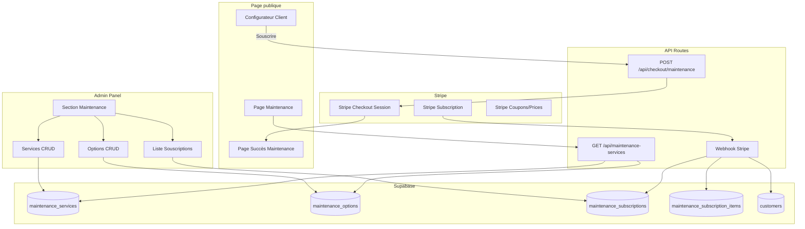

# Design Document: Contrats de Maintenance

## Overview

Ce document décrit l'architecture technique pour la fonctionnalité de contrats de maintenance Greenter. Le système étend l'application Next.js existante avec : des tables Supabase dédiées, une section admin pour gérer les services/options/souscriptions, un configurateur public interactif avec calcul de remises en temps réel, et une intégration Stripe en mode subscription.

L'architecture suit les conventions existantes : server components pour le data fetching, server actions pour les mutations, client components pour l'interactivité, et le pattern Stripe Checkout déjà en place pour les produits.

## Architecture



## Schéma de base de données

```sql
-- Types ENUM
DO $$ BEGIN
    CREATE TYPE billing_period AS ENUM ('monthly', 'yearly');
EXCEPTION WHEN duplicate_object THEN null;
END $$;

DO $$ BEGIN
    CREATE TYPE subscription_status AS ENUM ('active', 'cancelled', 'past_due', 'paused');
EXCEPTION WHEN duplicate_object THEN null;
END $$;

-- Services de maintenance
CREATE TABLE IF NOT EXISTS maintenance_services (
    id UUID PRIMARY KEY DEFAULT gen_random_uuid(),
    name TEXT NOT NULL,
    slug TEXT UNIQUE NOT NULL,
    description TEXT,
    price_monthly INTEGER NOT NULL, -- centimes
    icon TEXT DEFAULT 'Wrench',
    includes JSONB NOT NULL DEFAULT '[]',
    is_active BOOLEAN DEFAULT true,
    sort_order INTEGER DEFAULT 0,
    created_at TIMESTAMPTZ DEFAULT NOW()
);

-- Options de maintenance
CREATE TABLE IF NOT EXISTS maintenance_options (
    id UUID PRIMARY KEY DEFAULT gen_random_uuid(),
    name TEXT NOT NULL,
    slug TEXT UNIQUE NOT NULL,
    description TEXT,
    price_monthly INTEGER NOT NULL, -- centimes
    icon TEXT DEFAULT 'Zap',
    is_active BOOLEAN DEFAULT true,
    exempt_from_discount BOOLEAN DEFAULT true,
    sort_order INTEGER DEFAULT 0,
    created_at TIMESTAMPTZ DEFAULT NOW()
);

-- Souscriptions
CREATE TABLE IF NOT EXISTS maintenance_subscriptions (
    id UUID PRIMARY KEY DEFAULT gen_random_uuid(),
    customer_id UUID REFERENCES customers(id),
    stripe_subscription_id TEXT UNIQUE,
    billing_period billing_period NOT NULL,
    status subscription_status DEFAULT 'active',
    total_monthly INTEGER NOT NULL, -- centimes, avant remises
    discount_multi_percent INTEGER DEFAULT 0,
    discount_annual_percent INTEGER DEFAULT 0,
    total_after_discounts INTEGER NOT NULL, -- centimes, montant final
    created_at TIMESTAMPTZ DEFAULT NOW(),
    cancelled_at TIMESTAMPTZ
);

-- Items de souscription
CREATE TABLE IF NOT EXISTS maintenance_subscription_items (
    id UUID PRIMARY KEY DEFAULT gen_random_uuid(),
    subscription_id UUID REFERENCES maintenance_subscriptions(id) ON DELETE CASCADE,
    item_type TEXT NOT NULL CHECK (item_type IN ('service', 'option')),
    maintenance_service_id UUID REFERENCES maintenance_services(id) ON DELETE SET NULL,
    maintenance_option_id UUID REFERENCES maintenance_options(id) ON DELETE SET NULL,
    name TEXT NOT NULL,
    unit_price INTEGER NOT NULL -- centimes
);

-- Index
CREATE INDEX IF NOT EXISTS idx_maintenance_services_slug ON maintenance_services(slug);
CREATE INDEX IF NOT EXISTS idx_maintenance_options_slug ON maintenance_options(slug);
CREATE INDEX IF NOT EXISTS idx_maintenance_subs_customer ON maintenance_subscriptions(customer_id);
CREATE INDEX IF NOT EXISTS idx_maintenance_subs_stripe ON maintenance_subscriptions(stripe_subscription_id);
CREATE INDEX IF NOT EXISTS idx_maintenance_subs_status ON maintenance_subscriptions(status);
CREATE INDEX IF NOT EXISTS idx_maintenance_sub_items_sub ON maintenance_subscription_items(subscription_id);
```

## Interfaces TypeScript

```typescript
// types/maintenance.ts

export interface MaintenanceService {
  id: string;
  name: string;
  slug: string;
  description: string | null;
  price_monthly: number; // centimes
  icon: string;
  includes: string[];
  is_active: boolean;
  sort_order: number;
  created_at: string;
}

export interface MaintenanceOption {
  id: string;
  name: string;
  slug: string;
  description: string | null;
  price_monthly: number; // centimes
  icon: string;
  is_active: boolean;
  exempt_from_discount: boolean;
  sort_order: number;
  created_at: string;
}

export type BillingPeriod = 'monthly' | 'yearly';
export type SubscriptionStatus = 'active' | 'cancelled' | 'past_due' | 'paused';

export interface MaintenanceSubscription {
  id: string;
  customer_id: string;
  stripe_subscription_id: string | null;
  billing_period: BillingPeriod;
  status: SubscriptionStatus;
  total_monthly: number;
  discount_multi_percent: number;
  discount_annual_percent: number;
  total_after_discounts: number;
  created_at: string;
  cancelled_at: string | null;
}

export interface MaintenanceSubscriptionItem {
  id: string;
  subscription_id: string;
  item_type: 'service' | 'option';
  maintenance_service_id: string | null;
  maintenance_option_id: string | null;
  name: string;
  unit_price: number;
}

// Types pour le configurateur côté client
export interface ConfiguratorState {
  selectedServices: string[]; // IDs des services sélectionnés
  selectedOptions: string[]; // IDs des options sélectionnées
  billingPeriod: BillingPeriod;
}

export interface PricingSummary {
  servicesSubtotal: number; // centimes, total brut services
  discountMultiPercent: number;
  discountMultiAmount: number; // centimes
  servicesAfterMulti: number; // centimes
  optionsTotal: number; // centimes
  discountAnnualPercent: number;
  discountAnnualAmount: number; // centimes
  totalMonthly: number; // centimes
  totalAnnual: number; // centimes
  totalDisplay: number; // centimes, selon billingPeriod
  savingsTotal: number; // centimes, économies totales vs prix plein
}
```

## Logique de calcul des remises

```typescript
// lib/maintenance-pricing.ts

export function getMultiDiscount(serviceCount: number): number {
  if (serviceCount >= 4) return 15;
  if (serviceCount === 3) return 10;
  if (serviceCount === 2) return 5;
  return 0;
}

export function calculatePricing(
  services: MaintenanceService[],
  options: MaintenanceOption[],
  selectedServiceIds: string[],
  selectedOptionIds: string[],
  billingPeriod: BillingPeriod
): PricingSummary {
  const selectedServices = services.filter(s => selectedServiceIds.includes(s.id));
  const selectedOptions = options.filter(o => selectedOptionIds.includes(o.id));

  // Total brut services
  const servicesSubtotal = selectedServices.reduce((sum, s) => sum + s.price_monthly, 0);

  // Remise multi-équipements (services uniquement)
  const discountMultiPercent = getMultiDiscount(selectedServices.length);
  const discountMultiAmount = Math.round(servicesSubtotal * discountMultiPercent / 100);
  const servicesAfterMulti = servicesSubtotal - discountMultiAmount;

  // Total options (pas de remise)
  const optionsTotal = selectedOptions
    .filter(o => o.exempt_from_discount)
    .reduce((sum, o) => sum + o.price_monthly, 0);
  const discountableOptionsTotal = selectedOptions
    .filter(o => !o.exempt_from_discount)
    .reduce((sum, o) => sum + o.price_monthly, 0);

  // Remise annuelle (-10% sur services après multi + options non exemptées)
  const discountAnnualPercent = billingPeriod === 'yearly' ? 10 : 0;
  const discountableTotal = servicesAfterMulti + discountableOptionsTotal;
  const discountAnnualAmount = Math.round(discountableTotal * discountAnnualPercent / 100);

  // Totaux
  const totalMonthly = servicesAfterMulti + optionsTotal + discountableOptionsTotal - discountAnnualAmount;
  const totalAnnual = totalMonthly * 12;

  // Prix plein pour calcul économies
  const fullPriceMonthly = servicesSubtotal + optionsTotal + discountableOptionsTotal;
  const fullPriceForPeriod = billingPeriod === 'yearly' ? fullPriceMonthly * 12 : fullPriceMonthly;
  const actualPrice = billingPeriod === 'yearly' ? totalAnnual : totalMonthly;
  const savingsTotal = fullPriceForPeriod - actualPrice;

  return {
    servicesSubtotal,
    discountMultiPercent,
    discountMultiAmount,
    servicesAfterMulti,
    optionsTotal: optionsTotal + discountableOptionsTotal,
    discountAnnualPercent,
    discountAnnualAmount,
    totalMonthly,
    totalAnnual,
    totalDisplay: billingPeriod === 'yearly' ? totalAnnual : totalMonthly,
    savingsTotal,
  };
}
```

## Structure des fichiers

```
app/
├── (public)/
│   └── services/
│       └── maintenance/
│           ├── layout.tsx              # Metadata SEO
│           ├── page.tsx                # Page maintenance (server component, fetch data)
│           └── succes/
│               └── page.tsx            # Page succès souscription
├── administrator/
│   ├── maintenance/
│   │   ├── page.tsx                    # Liste services + options
│   │   ├── services/
│   │   │   ├── new/page.tsx            # Créer service
│   │   │   └── [id]/page.tsx           # Modifier service
│   │   ├── options/
│   │   │   ├── new/page.tsx            # Créer option
│   │   │   └── [id]/page.tsx           # Modifier option
│   │   └── subscriptions/
│   │       ├── page.tsx                # Liste souscriptions
│   │       └── [id]/page.tsx           # Détail souscription
│   └── actions/
│       └── maintenance.ts              # Server actions CRUD
├── api/
│   ├── maintenance-services/
│   │   └── route.ts                    # GET services + options actifs
│   └── checkout/
│       └── maintenance/
│           └── route.ts                # POST créer Stripe Checkout subscription

components/
├── MaintenanceConfigurator.tsx          # Configurateur client interactif
└── administrator/
    ├── MaintenanceServiceForm.tsx       # Formulaire service
    └── MaintenanceOptionForm.tsx        # Formulaire option

lib/
├── maintenance-pricing.ts              # Logique de calcul remises
└── email-templates.ts                  # (extension) Template email maintenance

types/
└── maintenance.ts                      # Interfaces TypeScript

supabase/
└── maintenance.sql                     # Schéma + seed en un seul fichier (copier-coller dans SQL editor Supabase)
```

## API Route: Checkout Maintenance

```typescript
// app/api/checkout/maintenance/route.ts
import { NextRequest, NextResponse } from 'next/server';
import Stripe from 'stripe';
import { supabase } from '@/lib/supabase';
import { calculatePricing, getMultiDiscount } from '@/lib/maintenance-pricing';

const stripe = new Stripe(process.env.STRIPE_SECRET_KEY!);

export async function POST(request: NextRequest) {
  const { serviceIds, optionIds, billingPeriod } = await request.json();

  // Fetch services et options depuis Supabase
  const { data: services } = await supabase
    .from('maintenance_services')
    .select('*')
    .in('id', serviceIds)
    .eq('is_active', true);

  const { data: options } = await supabase
    .from('maintenance_options')
    .select('*')
    .in('id', optionIds)
    .eq('is_active', true);

  if (!services?.length) {
    return NextResponse.json({ error: 'Aucun service sélectionné' }, { status: 400 });
  }

  // Calculer les prix
  const pricing = calculatePricing(services, options || [], serviceIds, optionIds, billingPeriod);

  // Créer les line_items Stripe
  const line_items: Stripe.Checkout.SessionCreateParams.LineItem[] = [];

  // Ajouter chaque service comme line_item avec prix ajusté
  for (const service of services) {
    const discountedPrice = Math.round(
      service.price_monthly * (1 - pricing.discountMultiPercent / 100)
    );
    const unitAmount = billingPeriod === 'yearly'
      ? Math.round(discountedPrice * 12 * (1 - pricing.discountAnnualPercent / 100))
      : discountedPrice;

    line_items.push({
      price_data: {
        currency: 'eur',
        product_data: { name: `Entretien ${service.name}` },
        unit_amount: unitAmount,
        recurring: {
          interval: billingPeriod === 'yearly' ? 'year' : 'month',
        },
      },
      quantity: 1,
    });
  }

  // Ajouter les options
  for (const option of (options || [])) {
    const unitAmount = billingPeriod === 'yearly'
      ? option.price_monthly * 12
      : option.price_monthly;

    line_items.push({
      price_data: {
        currency: 'eur',
        product_data: { name: option.name },
        unit_amount: unitAmount,
        recurring: {
          interval: billingPeriod === 'yearly' ? 'year' : 'month',
        },
      },
      quantity: 1,
    });
  }

  // Créer la session Stripe
  const session = await stripe.checkout.sessions.create({
    payment_method_types: ['card'],
    line_items,
    mode: 'subscription',
    success_url: `${process.env.NEXT_PUBLIC_SITE_URL}/services/maintenance/succes?session_id={CHECKOUT_SESSION_ID}`,
    cancel_url: `${process.env.NEXT_PUBLIC_SITE_URL}/services/maintenance`,
    billing_address_collection: 'required',
    phone_number_collection: { enabled: true },
    metadata: {
      type: 'maintenance',
      service_ids: serviceIds.join(','),
      option_ids: optionIds.join(','),
      billing_period: billingPeriod,
      discount_multi: String(pricing.discountMultiPercent),
      discount_annual: String(pricing.discountAnnualPercent),
    },
  });

  return NextResponse.json({ url: session.url });
}
```

## Webhook Stripe: Gestion des subscriptions

```typescript
// Extension du webhook existant pour gérer les événements subscription
// Événements à traiter :
// - customer.subscription.created → créer maintenance_subscription
// - customer.subscription.updated → mettre à jour statut
// - customer.subscription.deleted → marquer comme cancelled

async function handleSubscriptionEvent(event: Stripe.Event) {
  const subscription = event.data.object as Stripe.Subscription;
  const metadata = subscription.metadata;

  if (metadata.type !== 'maintenance') return;

  switch (event.type) {
    case 'customer.subscription.created': {
      // Upsert customer
      // Créer maintenance_subscription
      // Créer maintenance_subscription_items
      break;
    }
    case 'customer.subscription.updated': {
      // Mettre à jour le statut
      break;
    }
    case 'customer.subscription.deleted': {
      // Marquer comme cancelled + date
      break;
    }
  }
}
```

## Composant Configurateur

Le configurateur est un client component qui :
1. Reçoit les services et options en props (fetchés côté serveur)
2. Gère l'état local (checkboxes, billing period)
3. Calcule les prix en temps réel via `calculatePricing()`
4. Affiche un récapitulatif sticky sur desktop, bottom sheet sur mobile
5. Envoie la sélection à l'API checkout au clic sur "Souscrire"

Layout mobile-first :
- Mobile : checkboxes en liste verticale, récap en bas fixe
- Desktop : checkboxes à gauche (2/3), récap sticky à droite (1/3)

## Gestion des erreurs

| Erreur | Stratégie |
|--------|-----------|
| Aucun service sélectionné | Bouton "Souscrire" désactivé, message d'aide |
| Erreur Stripe Checkout | Message d'erreur français, retry possible |
| Service désactivé entre sélection et paiement | Vérification côté API, erreur 400 |
| Webhook subscription échoue | Log erreur, Stripe retry automatique |
| Suppression service avec souscriptions actives | Empêchée côté admin avec message |

## Propriétés de correction

### Propriété 1: Calcul remise multi-équipements
*Pour tout* ensemble de N services sélectionnés (N ≥ 1), la remise multi DOIT être : 0% si N=1, 5% si N=2, 10% si N=3, 15% si N≥4.

### Propriété 2: Remise non appliquée aux options exemptées
*Pour toute* option avec exempt_from_discount=true, son prix NE DOIT PAS être affecté par les remises multi ou annuelle.

### Propriété 3: Ordre d'application des remises
*Pour tout* calcul avec remise multi ET remise annuelle, le total final DOIT être égal à : (services × (1 - multi%)) × (1 - annuel%) + options_exemptées. L'ordre inverse donnerait un résultat différent.

### Propriété 4: Total toujours positif
*Pour toute* combinaison de services et options, le total après remises DOIT être strictement positif (> 0) dès qu'au moins un service est sélectionné.

### Propriété 5: Économies annuelles correctes
*Pour tout* calcul en mode annuel, les économies affichées DOIVENT être égales à (prix_plein_annuel - prix_remisé_annuel).
