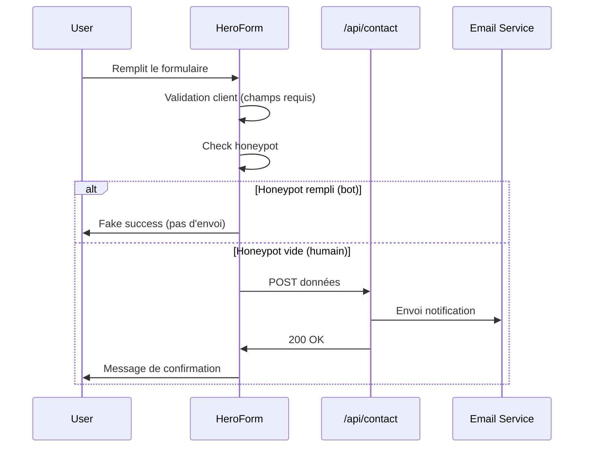

# Design Document: PAC Landing Page Optimization

## Overview

Ce document décrit l'architecture technique pour la refonte de la landing page `/services/pompe-a-chaleur` de Greenter. L'objectif est de maximiser les conversions Google Ads tout en inspirant confiance aux visiteurs français méfiants face aux arnaques dans le secteur de la rénovation énergétique.

### Objectifs principaux
- Intégrer un formulaire de devis directement dans le Hero (conversion immédiate)
- Afficher des trust signals visibles sans scroll (note Google, garanties, certifications)
- Optimiser pour le SEO local et le GEO (données structurées enrichies)
- Garantir une expérience mobile-first avec sticky CTA
- Réduire la longueur de page à 8 sections maximum

### Recherches intégrées
- Taux de conversion HVAC moyen : 15.11% (benchmark industrie)
- CTA dans le Hero = +40% de click-through
- 44 000 fraudes détectées en 2024 (ANAH) → nécessité de preuves de légitimité
- Mobile-first obligatoire (majorité du trafic Google Ads)

## Architecture

### Structure de page (8 sections)

```
┌─────────────────────────────────────────────────────────────┐
│  1. HERO SECTION                                            │
│  ┌─────────────────────┐  ┌─────────────────────────────┐  │
│  │ H1 + Value Prop     │  │ Quote Form                  │  │
│  │ Trust Signals       │  │ (nom, tel, email, projet,   │  │
│  │ (Google rating,     │  │  code postal)               │  │
│  │  garanties)         │  │                             │  │
│  │ CTAs (tel + form)   │  │ Honeypot anti-bot           │  │
│  └─────────────────────┘  └─────────────────────────────┘  │
├─────────────────────────────────────────────────────────────┤
│  2. POURQUOI GREENTER (Différenciateurs)                    │
│  - Proximité locale (Ozoir-la-Ferrière, 48h)               │
│  - Accompagnement aides (MaPrimeRénov', CEE)               │
│  - Photo équipe / technicien nommé                          │
│  - Pas de démarchage téléphonique                           │
├─────────────────────────────────────────────────────────────┤
│  3. TYPES DE PAC (3 options max)                            │
│  - PAC Air-Eau (populaire)                                  │
│  - PAC Air-Air                                              │
│  - PAC Géothermique                                         │
├─────────────────────────────────────────────────────────────┤
│  4. AIDES FINANCIÈRES                                       │
│  - MaPrimeRénov', CEE, TVA 5.5%, Éco-PTZ                   │
│  - Exemple de financement chiffré                           │
├─────────────────────────────────────────────────────────────┤
│  5. PROCESSUS (4 étapes)                                    │
│  - Visite technique → Devis → Installation → Mise en service│
├─────────────────────────────────────────────────────────────┤
│  6. FAQ (Accordéons)                                        │
│  - Questions générales + géolocalisées                      │
│  - Contenu masqué par défaut                                │
├─────────────────────────────────────────────────────────────┤
│  7. VILLES D'INTERVENTION                                   │
│  - 8 villes principales avec liens                          │
│  - Mention "Seine-et-Marne (77)"                            │
├─────────────────────────────────────────────────────────────┤
│  8. CTA FINAL                                               │
│  - Bouton devis + téléphone                                 │
└─────────────────────────────────────────────────────────────┘

MOBILE: Sticky CTA fixe en bas de l'écran pendant le scroll
```

### Flux de données



## Components and Interfaces

### Nouveaux composants à créer

#### 1. HeroQuoteForm

Formulaire de devis intégré dans le Hero, adapté du formulaire de contact existant.

```typescript
interface HeroQuoteFormProps {
  className?: string;
  onSuccess?: () => void;
}

interface QuoteFormData {
  name: string;
  phone: string;
  email: string;
  projectType: 'pac-air-eau' | 'pac-air-air' | 'pac-geo' | 'ne-sait-pas';
  postalCode: string;
  honeypot: string; // Champ invisible anti-bot
}

type FormState = 'idle' | 'loading' | 'success' | 'error';
```

Comportement :
- Validation côté client avant envoi
- Indicateur de chargement pendant l'envoi
- Message de confirmation après succès
- Protection honeypot (champ invisible)

#### 2. HeroTrustSignals

Affichage des signaux de confiance dans le Hero.

```typescript
interface HeroTrustSignalsProps {
  className?: string;
}

// Utilise GoogleRatingBadgeClient existant
// Affiche garanties : décennale, SAV local, RGE
```

#### 3. WhyGreenterSection

Section différenciateurs avec humanisation.

```typescript
interface WhyGreenterSectionProps {
  className?: string;
}

interface Differentiator {
  icon: LucideIcon;
  title: string;
  description: string;
}
```

#### 4. StickyCTA (Mobile)

Bouton fixe en bas de l'écran sur mobile.

```typescript
interface StickyCTAProps {
  targetId: string; // ID du formulaire pour scroll
  className?: string;
}
```

Comportement :
- Visible uniquement sur mobile (< 768px)
- Apparaît après scroll de 100vh
- Scroll smooth vers le formulaire au clic

#### 5. LegitimacySection

Section "Vérifiez notre légitimité" pour rassurer les visiteurs méfiants.

```typescript
interface LegitimacySectionProps {
  className?: string;
}

// Contient :
// - Lien vers annuaire RGE officiel
// - Adresse physique complète
// - Mention "Pas de démarchage téléphonique"
```

### Composants existants réutilisés

| Composant | Usage | Modifications |
|-----------|-------|---------------|
| `GoogleRatingBadgeClient` | Hero trust signals | Aucune |
| `GoogleReviewsCarousel` | Section avis | Aucune |
| `ServiceAreaSection` | Section villes | Aucune |
| `ServiceSchema` | SEO structured data | Aucune |
| `BreadcrumbSchema` | SEO structured data | Aucune |
| `FAQPageSchema` | SEO structured data | Aucune |

### Nouveaux schemas à ajouter

#### LocalBusinessSchema

```typescript
interface LocalBusinessSchemaProps {
  name: string;
  description: string;
  address: {
    streetAddress: string;
    addressLocality: string;
    postalCode: string;
    addressCountry: string;
  };
  telephone: string;
  email: string;
  url: string;
  image: string;
  priceRange: string;
  areaServed: string[];
  aggregateRating?: {
    ratingValue: number;
    reviewCount: number;
  };
}
```

#### AggregateRatingSchema

```typescript
interface AggregateRatingSchemaProps {
  itemReviewed: {
    type: string;
    name: string;
  };
  ratingValue: number;
  reviewCount: number;
  bestRating?: number;
  worstRating?: number;
}
```

## Data Models

### Données du formulaire

```typescript
// Données envoyées à /api/contact
interface ContactFormPayload {
  name: string;
  email: string;
  phone: string;
  service: string; // 'pac-air-eau' | 'pac-air-air' | 'pac-geo' | 'ne-sait-pas'
  message: string; // Généré automatiquement avec code postal
}
```

### Données des types de PAC

```typescript
interface PACType {
  id: string;
  title: string;
  description: string;
  image: string;
  specs: string[];
  popular: boolean;
}

const pacTypes: PACType[] = [
  {
    id: 'air-eau',
    title: 'PAC Air-Eau',
    description: 'Idéale pour le chauffage central et l\'eau chaude sanitaire.',
    image: '/pac-air_eau.svg',
    specs: ['COP jusqu\'à 5', 'Chauffage + ECS', 'Compatible radiateurs'],
    popular: true,
  },
  // ... 2 autres types
];
```

### Données des différenciateurs

```typescript
interface Differentiator {
  icon: LucideIcon;
  title: string;
  description: string;
  highlight?: boolean;
}

const differentiators: Differentiator[] = [
  {
    icon: MapPin,
    title: 'Proximité locale',
    description: 'Basé à Ozoir-la-Ferrière, intervention sous 48h en Seine-et-Marne.',
    highlight: true,
  },
  {
    icon: FileCheck,
    title: 'Accompagnement aides',
    description: 'On s\'occupe de vos dossiers MaPrimeRénov\' et CEE.',
  },
  {
    icon: PhoneOff,
    title: 'Pas de démarchage',
    description: 'Vous nous contactez, jamais l\'inverse. Conformité loi 2020.',
  },
  {
    icon: Users,
    title: 'Équipe locale',
    description: 'Techniciens salariés, pas de sous-traitance.',
  },
];
```

### Données FAQ enrichies

```typescript
interface FAQItem {
  question: string;
  answer: string;
  isLocal?: boolean; // Pour identifier les questions géolocalisées
}

const faqs: FAQItem[] = [
  // Questions générales existantes
  {
    question: 'Combien coûte l\'installation d\'une pompe à chaleur ?',
    answer: '...',
    isLocal: false,
  },
  // Questions géolocalisées (Requirement 7.3)
  {
    question: 'Combien coûte une PAC à Ozoir-la-Ferrière ?',
    answer: '...',
    isLocal: true,
  },
  {
    question: 'Quelles aides pour une PAC en Seine-et-Marne ?',
    answer: '...',
    isLocal: true,
  },
];
```

### Données Schema LocalBusiness

```typescript
const localBusinessData = {
  "@context": "https://schema.org",
  "@type": "LocalBusiness",
  "name": "Greenter",
  "description": "Installation de pompes à chaleur certifié RGE en Seine-et-Marne",
  "address": {
    "@type": "PostalAddress",
    "streetAddress": "38 Rue de Ménilmontant",
    "addressLocality": "Paris",
    "postalCode": "75020",
    "addressCountry": "FR"
  },
  "telephone": "+33609455056",
  "url": "https://greenter.fr",
  "image": "https://greenter.fr/logo.png",
  "priceRange": "€€",
  "areaServed": [
    "Ozoir-la-Ferrière",
    "Roissy-en-Brie",
    "Pontault-Combault",
    // ... autres villes
  ],
  "aggregateRating": {
    "@type": "AggregateRating",
    "ratingValue": "4.9",
    "reviewCount": "47"
  }
};
```


## Correctness Properties

*A property is a characteristic or behavior that should hold true across all valid executions of a system—essentially, a formal statement about what the system should do. Properties serve as the bridge between human-readable specifications and machine-verifiable correctness guarantees.*

### Property 1: Form submission with valid data triggers API call and success message

*For any* valid form data (non-empty name, valid phone, valid email, selected project type, valid postal code, empty honeypot), submitting the form should result in a POST request to `/api/contact` and display a success confirmation message.

**Validates: Requirements 1.3**

### Property 2: Honeypot protection prevents bot submissions

*For any* form submission where the honeypot field contains any non-empty value, the form should display a fake success message without making any API call to `/api/contact`.

**Validates: Requirements 1.4**

### Property 3: Loading state disables form during submission

*For any* form submission in progress, the submit button should be disabled and a loading indicator should be visible until the submission completes (success or error).

**Validates: Requirements 1.5**

### Property 4: Unique H1 contains required SEO keywords

*For any* rendered landing page, there should be exactly one H1 element, and it should contain both "pompe à chaleur" (case-insensitive) and a location reference (Ozoir-la-Ferrière or Seine-et-Marne).

**Validates: Requirements 4.1**

### Property 5: Heading hierarchy follows logical order

*For any* rendered landing page, the heading elements (H1-H6) should follow a logical hierarchy without skipping levels (e.g., H1 → H2 → H3, not H1 → H3).

**Validates: Requirements 4.2**

### Property 6: City links navigate to correct URLs

*For any* city link in the "Nos interventions par ville" section, clicking the link should navigate to a URL matching the pattern `/services/pompe-a-chaleur/{city-slug}` where `{city-slug}` corresponds to the city's slug from the CITIES data.

**Validates: Requirements 7.2**

## Error Handling

### Erreurs de formulaire

| Scénario | Comportement | Message utilisateur |
|----------|--------------|---------------------|
| Champ requis vide | Validation HTML5 native | "Veuillez remplir ce champ" |
| Email invalide | Validation HTML5 type="email" | "Veuillez saisir une adresse email valide" |
| Téléphone invalide | Validation pattern | "Format: 06 00 00 00 00" |
| Code postal invalide | Validation pattern (5 chiffres) | "Code postal à 5 chiffres" |
| Erreur API | Catch dans handleSubmit | "Une erreur est survenue. Veuillez réessayer ou nous contacter par téléphone." |
| Timeout réseau | Catch dans handleSubmit | Même message + numéro de téléphone visible |

### Erreurs de chargement des données

| Composant | Scénario | Comportement |
|-----------|----------|--------------|
| GoogleRatingBadgeClient | API /api/google-reviews échoue | Skeleton puis masquage du composant |
| GoogleReviewsCarousel | API /api/google-reviews échoue | Skeleton puis masquage de la section |
| StickyCTA | JavaScript désactivé | Fallback: CTA visible en permanence |

### Gestion des états

```typescript
// États du formulaire
type FormState = 'idle' | 'loading' | 'success' | 'error';

// Transitions d'état
// idle → loading (soumission)
// loading → success (API 200)
// loading → error (API erreur ou timeout)
// success → idle (reset formulaire)
// error → idle (retry)
```

## Testing Strategy

### Approche duale : Tests unitaires + Tests property-based

Les tests unitaires et property-based sont complémentaires :
- **Tests unitaires** : Exemples spécifiques, edge cases, intégration
- **Tests property-based** : Propriétés universelles sur tous les inputs

### Configuration Property-Based Testing

- **Bibliothèque** : `fast-check` (TypeScript/JavaScript)
- **Minimum iterations** : 100 par test
- **Tag format** : `Feature: pac-landing-page-optimization, Property {number}: {property_text}`

### Tests unitaires (exemples et edge cases)

```typescript
// __tests__/pac-landing-page.test.tsx

describe('HeroQuoteForm', () => {
  // Requirement 1.1 - Form visible dans Hero
  it('should render form visible without scroll on desktop', () => {
    // Vérifier que le formulaire est dans le viewport initial
  });

  // Requirement 1.2 - Champs requis
  it('should contain all required fields: name, phone, email, projectType, postalCode', () => {
    // Vérifier présence de tous les champs
  });

  // Requirement 1.6 - Accessibilité
  it('should have accessible labels for all form fields', () => {
    // Vérifier aria-labels et labels associés
  });

  // Requirement 1.6 - Navigation clavier
  it('should support keyboard navigation', () => {
    // Vérifier focus order et tab navigation
  });
});

describe('TrustSignals', () => {
  // Requirement 2.1 - Note Google
  it('should display Google rating badge in Hero', () => {});

  // Requirement 2.2 - Garanties
  it('should display at least 2 key guarantees', () => {});

  // Requirement 2.4 - Avis avec noms et dates
  it('should display reviews with author names and dates', () => {});
});

describe('SEO Structure', () => {
  // Requirement 4.3-4.6 - Schemas
  it('should include LocalBusiness schema', () => {});
  it('should include Service schema', () => {});
  it('should include FAQPage schema', () => {});
  it('should include AggregateRating schema', () => {});
});

describe('Mobile Experience', () => {
  // Requirement 5.1 - Sticky CTA
  it('should show sticky CTA on mobile after scroll', () => {});

  // Requirement 5.3 - Form responsive
  it('should be usable at 375px width', () => {});

  // Requirement 5.5 - Tel link
  it('should have tel: link for phone number', () => {});
});

describe('Content Requirements', () => {
  // Requirement 6.2 - Pas de démarchage
  it('should mention "Pas de démarchage téléphonique"', () => {});

  // Requirement 6.3 - Adresse
  it('should display complete physical address', () => {});

  // Requirement 7.3 - FAQ géolocalisées
  it('should include at least 2 geolocalized FAQ questions', () => {});

  // Requirement 8.1 - Max 8 sections
  it('should have maximum 8 distinct sections', () => {});

  // Requirement 8.4 - Max 3 PAC types
  it('should display maximum 3 PAC types', () => {});
});
```

### Tests property-based

```typescript
// __tests__/properties/pac-landing-page.property.test.ts
import fc from 'fast-check';

describe('PAC Landing Page Properties', () => {
  // Feature: pac-landing-page-optimization, Property 1: Form submission with valid data
  it('should submit valid form data to API and show success', async () => {
    await fc.assert(
      fc.asyncProperty(
        fc.record({
          name: fc.string({ minLength: 1 }),
          phone: fc.stringMatching(/^0[1-9][0-9]{8}$/),
          email: fc.emailAddress(),
          projectType: fc.constantFrom('pac-air-eau', 'pac-air-air', 'pac-geo', 'ne-sait-pas'),
          postalCode: fc.stringMatching(/^[0-9]{5}$/),
        }),
        async (formData) => {
          // Mock API, submit form, verify API called and success shown
        }
      ),
      { numRuns: 100 }
    );
  });

  // Feature: pac-landing-page-optimization, Property 2: Honeypot protection
  it('should not call API when honeypot is filled', async () => {
    await fc.assert(
      fc.asyncProperty(
        fc.string({ minLength: 1 }), // honeypot value
        async (honeypotValue) => {
          // Submit form with honeypot filled
          // Verify API NOT called but success shown
        }
      ),
      { numRuns: 100 }
    );
  });

  // Feature: pac-landing-page-optimization, Property 3: Loading state
  it('should disable button during submission', async () => {
    await fc.assert(
      fc.asyncProperty(
        fc.record({
          name: fc.string({ minLength: 1 }),
          // ... valid form data
        }),
        async (formData) => {
          // Start submission, verify button disabled and loading shown
        }
      ),
      { numRuns: 100 }
    );
  });

  // Feature: pac-landing-page-optimization, Property 4: Unique H1 with keywords
  it('should have exactly one H1 with required keywords', () => {
    // Render page, find all H1s
    // Assert count === 1
    // Assert H1 contains "pompe à chaleur" and location
  });

  // Feature: pac-landing-page-optimization, Property 5: Heading hierarchy
  it('should maintain logical heading hierarchy', () => {
    // Render page, collect all headings
    // Verify no level skips (H1→H3 without H2)
  });

  // Feature: pac-landing-page-optimization, Property 6: City links
  it('should have correct URLs for all city links', () => {
    await fc.assert(
      fc.property(
        fc.constantFrom(...CITIES),
        (city) => {
          // Find link for city
          // Verify href === `/services/pompe-a-chaleur/${city.slug}`
        }
      ),
      { numRuns: 100 }
    );
  });
});
```

### Couverture des requirements

| Requirement | Type de test | Propriété/Exemple |
|-------------|--------------|-------------------|
| 1.1 | Unit test | Example |
| 1.2 | Unit test | Example |
| 1.3 | Property test | Property 1 |
| 1.4 | Property test | Property 2 |
| 1.5 | Property test | Property 3 |
| 1.6 | Unit test | Example |
| 2.1-2.4 | Unit test | Examples |
| 3.1-3.4 | Unit test | Examples |
| 4.1 | Property test | Property 4 |
| 4.2 | Property test | Property 5 |
| 4.3-4.6 | Unit test | Examples |
| 4.7 | Manual (Lighthouse) | N/A |
| 5.1-5.5 | Unit test | Examples |
| 6.1-6.4 | Unit test | Examples |
| 7.1 | Unit test | Example |
| 7.2 | Property test | Property 6 |
| 7.3-7.4 | Unit test | Examples |
| 8.1-8.4 | Unit test | Examples |
