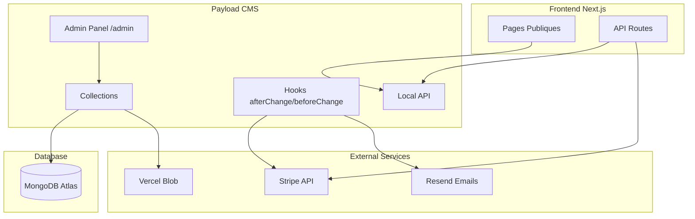
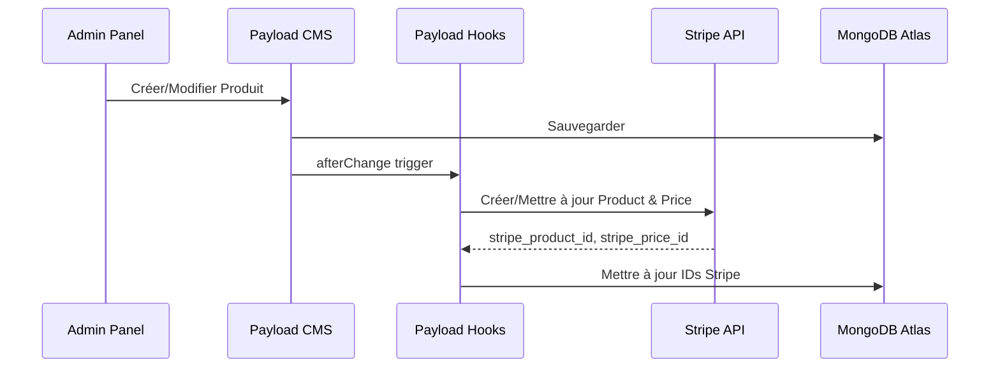
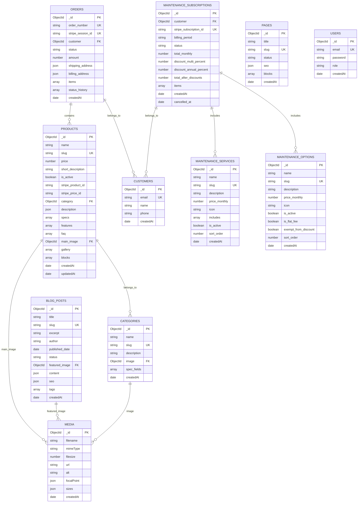

# Design Document: Migration Payload CMS

## Overview

Ce document décrit l'architecture technique pour la migration complète du site e-commerce Greenter de Supabase vers Payload CMS avec MongoDB Atlas. Cette migration unifie la gestion de contenu et des données dans un seul système, simplifiant l'architecture et offrant une interface admin professionnelle.

### Objectifs Principaux

1. **Unification Backend** : Remplacer Supabase par Payload CMS + MongoDB Atlas
2. **Admin Unifié** : Interface admin Payload à `/admin` remplaçant l'admin custom `/administrator`
3. **Contenu Modulaire** : Système de Blocks pour pages produits et landing pages
4. **Intégration Stripe** : Hooks Payload pour synchronisation automatique produits/prix
5. **Migration Données** : Script idempotent pour migrer toutes les données existantes

### Stack Technique

- **CMS** : Payload CMS 3.x (App Router integration)
- **Base de données** : MongoDB Atlas (tier gratuit 512MB)
- **Framework** : Next.js 16 (existant)
- **Paiements** : Stripe (conservé)
- **Emails** : Resend (conservé)
- **Stockage Media** : Cloudinary (free tier)
- **Déploiement** : Vercel

## Architecture

### Architecture Globale



### Flux de Données



### Structure des Dossiers

```
greenter/
├── app/
│   ├── (payload)/           # Routes Payload Admin
│   │   ├── admin/
│   │   │   └── [[...segments]]/
│   │   │       └── page.tsx
│   │   └── api/
│   │       └── [...slug]/
│   │           └── route.ts
│   ├── (public)/            # Routes publiques (existantes)
│   │   ├── produits/
│   │   ├── blog/            # Nouveau
│   │   └── [slug]/          # Pages dynamiques
│   └── api/
│       └── webhook/
│           └── stripe/
├── collections/             # Définitions Payload
│   ├── Products.ts
│   ├── Categories.ts
│   ├── Media.ts
│   ├── Customers.ts
│   ├── Orders.ts
│   ├── MaintenanceServices.ts
│   ├── MaintenanceOptions.ts
│   ├── MaintenanceSubscriptions.ts
│   ├── BlogPosts.ts
│   ├── Pages.ts
│   └── Users.ts
├── blocks/                  # Blocks modulaires
│   ├── Hero.ts
│   ├── SpecsTable.ts
│   ├── FAQ.ts
│   ├── Gallery.ts
│   ├── ComparisonChart.ts
│   ├── CTA.ts
│   └── RichText.ts
├── hooks/                   # Hooks Payload
│   ├── syncProductToStripe.ts
│   └── generateOrderNumber.ts
├── payload.config.ts        # Configuration principale
└── payload-types.ts         # Types générés
```

## Components and Interfaces

### Configuration Payload

```typescript
// payload.config.ts
import { buildConfig } from 'payload'
import { mongooseAdapter } from '@payloadcms/db-mongodb'
import { lexicalEditor } from '@payloadcms/richtext-lexical'
import { cloudinaryStorage } from '@payloadcms/storage-cloudinary'

export default buildConfig({
  secret: process.env.PAYLOAD_SECRET!,
  admin: {
    user: 'users',
  },
  db: mongooseAdapter({
    url: process.env.MONGODB_URI!,
  }),
  editor: lexicalEditor(),
  collections: [
    Products,
    Categories,
    Media,
    Customers,
    Orders,
    MaintenanceServices,
    MaintenanceOptions,
    MaintenanceSubscriptions,
    BlogPosts,
    Pages,
    Users,
  ],
  plugins: [
    cloudinaryStorage({
      collections: {
        media: true,
      },
      config: {
        cloud_name: process.env.CLOUDINARY_CLOUD_NAME!,
        api_key: process.env.CLOUDINARY_API_KEY!,
        api_secret: process.env.CLOUDINARY_API_SECRET!,
      },
    }),
  ],
  typescript: {
    outputFile: 'payload-types.ts',
  },
})
```

### Interface Collection Products

```typescript
// collections/Products.ts
import type { CollectionConfig } from 'payload'
import { syncProductToStripe } from '@/hooks/syncProductToStripe'
import { slugField } from '@/fields/slug'
import { ProductBlocks } from '@/blocks'

export const Products: CollectionConfig = {
  slug: 'products',
  admin: {
    useAsTitle: 'name',
    defaultColumns: ['name', 'category', 'price', 'is_active'],
  },
  hooks: {
    afterChange: [syncProductToStripe],
  },
  fields: [
    { name: 'name', type: 'text', required: true },
    slugField('name'),
    { name: 'price', type: 'number', required: true, min: 0 },
    { name: 'short_description', type: 'textarea' },
    { name: 'is_active', type: 'checkbox', defaultValue: true },
    { name: 'stripe_product_id', type: 'text', admin: { readOnly: true } },
    { name: 'stripe_price_id', type: 'text', admin: { readOnly: true } },
    {
      name: 'category',
      type: 'relationship',
      relationTo: 'categories',
      required: true,
    },
    {
      name: 'description',
      type: 'richText',
      editor: lexicalEditor(),
    },
    {
      name: 'specs',
      type: 'array',
      fields: [
        { name: 'label', type: 'text', required: true },
        { name: 'value', type: 'text', required: true },
        { name: 'unit', type: 'text' },
      ],
    },
    {
      name: 'features',
      type: 'array',
      fields: [
        { name: 'icon', type: 'select', options: ICON_OPTIONS },
        { name: 'title', type: 'text', required: true },
        { name: 'description', type: 'textarea' },
      ],
    },
    {
      name: 'faq',
      type: 'array',
      fields: [
        { name: 'question', type: 'text', required: true },
        { name: 'answer', type: 'richText' },
      ],
    },
    { name: 'main_image', type: 'upload', relationTo: 'media' },
    {
      name: 'gallery',
      type: 'array',
      maxRows: 10,
      fields: [{ name: 'image', type: 'upload', relationTo: 'media' }],
    },
    {
      name: 'blocks',
      type: 'blocks',
      blocks: ProductBlocks,
    },
  ],
}
```

### Interface Collection Orders

```typescript
// collections/Orders.ts
import type { CollectionConfig } from 'payload'

export const Orders: CollectionConfig = {
  slug: 'orders',
  admin: {
    useAsTitle: 'order_number',
    defaultColumns: ['order_number', 'customer', 'status', 'amount', 'createdAt'],
  },
  access: {
    read: ({ req }) => !!req.user,
    create: () => true, // Webhook peut créer
    update: ({ req }) => !!req.user,
    delete: ({ req }) => !!req.user,
  },
  fields: [
    {
      name: 'order_number',
      type: 'text',
      required: true,
      unique: true,
      admin: { readOnly: true },
    },
    { name: 'stripe_session_id', type: 'text', unique: true },
    {
      name: 'customer',
      type: 'relationship',
      relationTo: 'customers',
      required: true,
    },
    {
      name: 'status',
      type: 'select',
      required: true,
      defaultValue: 'pending',
      options: [
        { label: 'En attente', value: 'pending' },
        { label: 'Payée', value: 'paid' },
        { label: 'Expédiée', value: 'shipped' },
        { label: 'Livrée', value: 'delivered' },
        { label: 'Annulée', value: 'cancelled' },
      ],
    },
    { name: 'amount', type: 'number', required: true, min: 0 },
    { name: 'shipping_address', type: 'json' },
    { name: 'billing_address', type: 'json' },
    {
      name: 'items',
      type: 'array',
      fields: [
        { name: 'product_name', type: 'text', required: true },
        { name: 'quantity', type: 'number', required: true, min: 1 },
        { name: 'unit_price', type: 'number', required: true },
        { name: 'product', type: 'relationship', relationTo: 'products' },
      ],
    },
    {
      name: 'status_history',
      type: 'array',
      admin: { readOnly: true },
      fields: [
        { name: 'status', type: 'text' },
        { name: 'changed_at', type: 'date' },
        { name: 'changed_by', type: 'relationship', relationTo: 'users' },
      ],
    },
  ],
}
```

### Hook Synchronisation Stripe

```typescript
// hooks/syncProductToStripe.ts
import type { CollectionAfterChangeHook } from 'payload'
import { stripe } from '@/lib/stripe'

export const syncProductToStripe: CollectionAfterChangeHook = async ({
  doc,
  previousDoc,
  operation,
  req,
}) => {
  const payload = req.payload

  // Création d'un nouveau produit
  if (operation === 'create') {
    const stripeProduct = await stripe.products.create({
      name: doc.name,
      description: doc.short_description || undefined,
    })

    const stripePrice = await stripe.prices.create({
      product: stripeProduct.id,
      unit_amount: doc.price,
      currency: 'eur',
    })

    // Mettre à jour le document avec les IDs Stripe
    await payload.update({
      collection: 'products',
      id: doc.id,
      data: {
        stripe_product_id: stripeProduct.id,
        stripe_price_id: stripePrice.id,
      },
    })

    return { ...doc, stripe_product_id: stripeProduct.id, stripe_price_id: stripePrice.id }
  }

  // Mise à jour d'un produit existant
  if (operation === 'update' && doc.stripe_product_id) {
    // Mettre à jour le produit Stripe
    await stripe.products.update(doc.stripe_product_id, {
      name: doc.name,
      description: doc.short_description || '',
      active: doc.is_active,
    })

    // Si le prix a changé, créer un nouveau prix et archiver l'ancien
    if (previousDoc?.price !== doc.price && doc.stripe_price_id) {
      const newPrice = await stripe.prices.create({
        product: doc.stripe_product_id,
        unit_amount: doc.price,
        currency: 'eur',
      })

      await stripe.prices.update(doc.stripe_price_id, { active: false })

      await payload.update({
        collection: 'products',
        id: doc.id,
        data: { stripe_price_id: newPrice.id },
      })

      return { ...doc, stripe_price_id: newPrice.id }
    }
  }

  return doc
}
```

### Interface Block Hero

```typescript
// blocks/Hero.ts
import type { Block } from 'payload'

export const HeroBlock: Block = {
  slug: 'hero',
  labels: { singular: 'Hero', plural: 'Heroes' },
  fields: [
    { name: 'heading', type: 'text', required: true },
    { name: 'subheading', type: 'textarea' },
    { name: 'background_image', type: 'upload', relationTo: 'media' },
    { name: 'cta_text', type: 'text' },
    { name: 'cta_link', type: 'text' },
    {
      name: 'alignment',
      type: 'select',
      defaultValue: 'center',
      options: [
        { label: 'Gauche', value: 'left' },
        { label: 'Centre', value: 'center' },
        { label: 'Droite', value: 'right' },
      ],
    },
    { name: 'overlay_color', type: 'text' },
    { name: 'overlay_opacity', type: 'number', min: 0, max: 100, defaultValue: 50 },
  ],
}
```

### Interface Accès aux Données (Local API)

```typescript
// lib/payload.ts
import { getPayload } from 'payload'
import config from '@/payload.config'

export async function getPayloadClient() {
  return getPayload({ config })
}

// Exemple d'utilisation dans une page
// app/(public)/produits/[categorySlug]/[productSlug]/page.tsx
export default async function ProductPage({ params }) {
  const payload = await getPayloadClient()
  
  const { docs: products } = await payload.find({
    collection: 'products',
    where: {
      slug: { equals: params.productSlug },
      is_active: { equals: true },
    },
    depth: 2, // Inclure category et media
  })
  
  if (!products.length) notFound()
  
  return <ProductTemplate product={products[0]} />
}
```

## Data Models

### Schéma MongoDB - Collections Principales



### Types TypeScript Générés

```typescript
// payload-types.ts (généré automatiquement)
export interface Product {
  id: string
  name: string
  slug: string
  price: number
  short_description?: string
  is_active: boolean
  stripe_product_id?: string
  stripe_price_id?: string
  category: string | Category
  description?: RichTextContent
  specs?: Array<{ label: string; value: string; unit?: string }>
  features?: Array<{ icon?: string; title: string; description?: string }>
  faq?: Array<{ question: string; answer?: RichTextContent }>
  main_image?: string | Media
  gallery?: Array<{ image: string | Media }>
  blocks?: ProductBlock[]
  createdAt: string
  updatedAt: string
}

export interface Category {
  id: string
  name: string
  slug: string
  description?: string
  image?: string | Media
  spec_fields?: Array<{
    name: string
    key: string
    type: 'text' | 'number' | 'select'
    unit?: string
    required: boolean
    options?: string[]
  }>
  createdAt: string
}

export interface Order {
  id: string
  order_number: string
  stripe_session_id?: string
  customer: string | Customer
  status: 'pending' | 'paid' | 'shipped' | 'delivered' | 'cancelled'
  amount: number
  shipping_address?: Address
  billing_address?: Address
  items: Array<{
    product_name: string
    quantity: number
    unit_price: number
    product?: string | Product
  }>
  status_history?: Array<{
    status: string
    changed_at: string
    changed_by?: string | User
  }>
  createdAt: string
}

export interface Customer {
  id: string
  email: string
  name?: string
  phone?: string
  createdAt: string
}

export interface MaintenanceSubscription {
  id: string
  customer: string | Customer
  stripe_subscription_id?: string
  billing_period: 'monthly' | 'yearly'
  status: 'active' | 'cancelled' | 'past_due' | 'paused'
  total_monthly: number
  discount_multi_percent: number
  discount_annual_percent: number
  total_after_discounts: number
  items: Array<{
    item_type: 'service' | 'option'
    name: string
    unit_price: number
    service_id?: string
    option_id?: string
  }>
  createdAt: string
  cancelled_at?: string
}

export interface BlogPost {
  id: string
  title: string
  slug: string
  excerpt?: string
  author?: string
  published_date?: string
  status: 'draft' | 'published'
  featured_image?: string | Media
  content?: RichTextContent
  seo?: { meta_title?: string; meta_description?: string; og_image?: string | Media }
  tags?: string[]
  createdAt: string
}

export interface Page {
  id: string
  title: string
  slug: string
  status: 'draft' | 'published'
  seo?: { meta_title?: string; meta_description?: string; og_image?: string | Media }
  blocks?: PageBlock[]
  createdAt: string
}

export type ProductBlock = HeroBlock | SpecsTableBlock | FAQBlock | GalleryBlock | CTABlock | RichTextBlock
export type PageBlock = HeroBlock | FAQBlock | GalleryBlock | ComparisonChartBlock | CTABlock | RichTextBlock
```

### Mapping Migration Supabase → Payload

| Supabase Table | Payload Collection | Notes |
|----------------|-------------------|-------|
| products | products | Ajouter blocks, enrichir specs/features/faq |
| categories | categories | Structure similaire |
| customers | customers | Structure identique |
| orders | orders | Ajouter status_history |
| order_items | orders.items | Intégré comme array |
| maintenance_services | maintenance-services | Structure similaire |
| maintenance_options | maintenance-options | Structure similaire |
| maintenance_subscriptions | maintenance-subscriptions | Structure similaire |
| maintenance_subscription_items | maintenance-subscriptions.items | Intégré comme array |
| - | blog-posts | Nouvelle collection |
| - | pages | Nouvelle collection |
| - | media | Nouvelle collection |
| - | users | Remplace auth Supabase |


## Correctness Properties

*A property is a characteristic or behavior that should hold true across all valid executions of a system—essentially, a formal statement about what the system should do. Properties serve as the bridge between human-readable specifications and machine-verifiable correctness guarantees.*

### Property 1: Slug Auto-Generation

*For any* product or category with a name but no slug provided, saving the document should result in a valid slug being auto-generated from the name (lowercase, hyphenated, no special characters).

**Validates: Requirements 2.11, 3.1**

### Property 2: Category Deletion Protection

*For any* category that has one or more products assigned to it, attempting to delete that category should fail with a validation error, and the category should remain in the database.

**Validates: Requirements 3.4**

### Property 3: Media File Type Validation

*For any* file upload to the Media collection, if the file type is one of (jpg, png, webp, svg, gif), the upload should succeed; otherwise, it should be rejected.

**Validates: Requirements 4.1**

### Property 4: Media File Size Limit

*For any* file upload to the Media collection, if the file size exceeds 5MB, the upload should be rejected with an appropriate error message.

**Validates: Requirements 4.2**

### Property 5: Responsive Image Generation

*For any* successfully uploaded image to the Media collection, the system should auto-generate responsive sizes (thumbnail 150px, card 400px, medium 800px, large 1200px).

**Validates: Requirements 4.3**

### Property 6: Admin-Only Collection Access

*For any* request to Customers, Orders, or Maintenance_Subscriptions collections from a non-authenticated or non-admin user, the request should be denied with appropriate access control error.

**Validates: Requirements 5.5, 6.8, 23.1, 23.3**

### Property 7: Public Content Read Access

*For any* public (unauthenticated) request to Products, Categories, Media, or published Blog_Posts/Pages, the request should succeed and return the requested data.

**Validates: Requirements 23.4**

### Property 8: Order Status History Logging

*For any* order where the status field is changed, a new entry should be automatically added to the status_history array containing the new status, timestamp, and user who made the change.

**Validates: Requirements 6.7**

### Property 9: Draft Content Public Access Denial

*For any* Blog_Post or Page with status "draft", a public request to view that content should return a 404 response.

**Validates: Requirements 10.7, 20.6, 21.4**

### Property 10: Inactive Product 404

*For any* product with is_active set to false, a request to the product page at `/produits/[categorySlug]/[productSlug]` should return a 404 response.

**Validates: Requirements 19.6**

### Property 11: Reserved Slug Validation

*For any* Page being saved with a slug that matches a reserved route (produits, blog, contact, services, admin, api), the save operation should fail with a validation error.

**Validates: Requirements 11.5**

### Property 12: Product-Stripe Synchronization

*For any* product created or updated in Payload:
- On create: a corresponding Stripe product and price should be created, and their IDs stored in the document
- On price update: a new Stripe price should be created, the old one archived, and the new ID stored
- On deactivation: the Stripe product should be archived

**Validates: Requirements 22.1, 22.2, 22.3**

### Property 13: Stripe Webhook Order Creation

*For any* Stripe checkout.session.completed webhook event with payment_status "paid", an Order should be created in Payload with the correct order_number, customer relationship, amount, and items.

**Validates: Requirements 22.5, 22.6**

### Property 14: Stripe Subscription Webhook Handling

*For any* Stripe subscription webhook event (created, updated, deleted) with metadata.type "maintenance", the corresponding Maintenance_Subscription record should be created or updated in Payload with the correct status.

**Validates: Requirements 22.7**

### Property 15: Blocks Render Order Preservation

*For any* Product, Page, or Blog_Post with multiple blocks configured, rendering the page should display all blocks in the exact order they were configured in the admin panel.

**Validates: Requirements 19.3, 21.2**

### Property 16: Block Auto-Population from Parent

*For any* Specs_Table_Block, FAQ_Block, or Gallery_Block used within a Product document:
- Specs_Table should auto-populate from product.specs if no custom specs provided
- FAQ_Block should auto-populate from product.faq if no custom FAQ provided
- Gallery_Block should auto-populate from product.gallery if no custom images provided

**Validates: Requirements 13.1, 14.3, 15.4**

### Property 17: Structured Data Generation

*For any* Product page, Blog_Post page, or FAQ_Block, the rendered output should include valid JSON-LD structured data conforming to Schema.org specifications (Product, Article, or FAQPage respectively).

**Validates: Requirements 14.4, 19.4, 20.4**

### Property 18: Related Articles by Tags

*For any* published Blog_Post with one or more tags, the related articles section should display other published posts that share at least one tag, excluding the current post.

**Validates: Requirements 20.5**

### Property 19: MRR Calculation Accuracy

*For any* set of active Maintenance_Subscriptions, the MRR (Monthly Recurring Revenue) displayed in the admin panel should equal the sum of total_after_discounts for all subscriptions with status "active", converted to monthly amounts.

**Validates: Requirements 9.5**

### Property 20: Migration Data Integrity

*For any* record migrated from Supabase to Payload (products, categories, customers, orders, maintenance services/options/subscriptions), all fields including Stripe IDs should be preserved exactly, and relationships should be correctly re-established.

**Validates: Requirements 24.1-24.7**

### Property 21: Migration Idempotency

*For any* execution of the migration script, running it multiple times should produce the same final state as running it once—no duplicate records should be created, and existing records should be updated rather than duplicated.

**Validates: Requirements 24.8**

### Property 22: Customer Email Uniqueness

*For any* attempt to create a Customer with an email that already exists in the database, the operation should either update the existing customer (upsert) or fail with a uniqueness constraint error.

**Validates: Requirements 5.1, 22.6**

## Error Handling

### Database Connection Errors

```typescript
// lib/payload.ts
export async function getPayloadClient() {
  try {
    return await getPayload({ config })
  } catch (error) {
    console.error('Failed to initialize Payload:', error)
    throw new Error('Database connection failed')
  }
}
```

### Stripe Integration Errors

```typescript
// hooks/syncProductToStripe.ts
export const syncProductToStripe: CollectionAfterChangeHook = async ({ doc, operation, req }) => {
  try {
    // Stripe operations...
  } catch (error) {
    // Log error but don't fail the save operation
    console.error('Stripe sync failed:', error)
    req.payload.logger.error({
      msg: 'Failed to sync product to Stripe',
      productId: doc.id,
      error: error.message,
    })
    // Return doc without Stripe IDs - can be retried manually
    return doc
  }
}
```

### Webhook Error Handling

```typescript
// app/api/webhook/stripe/route.ts
export async function POST(request: NextRequest) {
  try {
    const event = stripe.webhooks.constructEvent(body, signature, webhookSecret)
    
    switch (event.type) {
      case 'checkout.session.completed':
        await handleCheckoutCompleted(event.data.object)
        break
      case 'customer.subscription.created':
      case 'customer.subscription.updated':
      case 'customer.subscription.deleted':
        await handleSubscriptionEvent(event)
        break
    }
    
    return NextResponse.json({ received: true })
  } catch (error) {
    if (error instanceof Stripe.errors.StripeSignatureVerificationError) {
      return NextResponse.json({ error: 'Invalid signature' }, { status: 400 })
    }
    
    console.error('Webhook error:', error)
    // Return 200 to prevent Stripe retries for non-recoverable errors
    return NextResponse.json({ received: true, error: 'Processing failed' })
  }
}
```

### Media Upload Errors

```typescript
// collections/Media.ts
export const Media: CollectionConfig = {
  slug: 'media',
  upload: {
    staticDir: 'media',
    mimeTypes: ['image/jpeg', 'image/png', 'image/webp', 'image/svg+xml', 'image/gif'],
    filesizeLimit: 5 * 1024 * 1024, // 5MB
  },
  hooks: {
    beforeValidate: [
      ({ data, req }) => {
        if (data?.filesize > 5 * 1024 * 1024) {
          throw new Error('La taille du fichier ne doit pas dépasser 5MB')
        }
        return data
      },
    ],
  },
}
```

### Access Control Errors

```typescript
// collections/Orders.ts
access: {
  read: ({ req }) => {
    if (!req.user) {
      return false // Returns 401 Unauthorized
    }
    return true
  },
  update: ({ req }) => {
    if (!req.user) {
      return false
    }
    return true
  },
  delete: () => false, // Orders cannot be deleted
}
```

### Migration Error Recovery

```typescript
// scripts/migrate.ts
async function migrateWithRetry<T>(
  operation: () => Promise<T>,
  maxRetries = 3
): Promise<T> {
  for (let attempt = 1; attempt <= maxRetries; attempt++) {
    try {
      return await operation()
    } catch (error) {
      if (attempt === maxRetries) throw error
      console.log(`Attempt ${attempt} failed, retrying...`)
      await new Promise(r => setTimeout(r, 1000 * attempt))
    }
  }
  throw new Error('Max retries exceeded')
}

async function migrate() {
  const results = {
    products: { success: 0, failed: 0, errors: [] },
    categories: { success: 0, failed: 0, errors: [] },
    // ...
  }
  
  // Log results at end for manual review
  console.log('Migration results:', JSON.stringify(results, null, 2))
}
```

## Testing Strategy

### Dual Testing Approach

Cette migration nécessite à la fois des tests unitaires pour les cas spécifiques et des tests property-based pour valider les comportements universels.

### Property-Based Testing Configuration

**Bibliothèque** : fast-check (déjà installé dans le projet)

**Configuration minimale** : 100 itérations par test

**Format de tag** : `Feature: payload-cms-migration, Property {number}: {property_text}`

### Tests Property-Based

```typescript
// __tests__/properties/slug-generation.test.ts
import fc from 'fast-check'
import { generateSlug } from '@/lib/slugify'

describe('Property 1: Slug Auto-Generation', () => {
  // Feature: payload-cms-migration, Property 1: Slug Auto-Generation
  it('should generate valid slug from any product name', () => {
    fc.assert(
      fc.property(
        fc.string({ minLength: 1, maxLength: 200 }),
        (name) => {
          const slug = generateSlug(name)
          // Slug should be lowercase
          expect(slug).toBe(slug.toLowerCase())
          // Slug should not contain special characters except hyphens
          expect(slug).toMatch(/^[a-z0-9-]*$/)
          // Slug should not start or end with hyphen
          if (slug.length > 0) {
            expect(slug[0]).not.toBe('-')
            expect(slug[slug.length - 1]).not.toBe('-')
          }
        }
      ),
      { numRuns: 100 }
    )
  })
})
```

```typescript
// __tests__/properties/access-control.test.ts
import fc from 'fast-check'

describe('Property 6: Admin-Only Collection Access', () => {
  // Feature: payload-cms-migration, Property 6: Admin-Only Collection Access
  it('should deny access to protected collections for non-admin users', () => {
    const protectedCollections = ['customers', 'orders', 'maintenance-subscriptions']
    
    fc.assert(
      fc.property(
        fc.constantFrom(...protectedCollections),
        fc.record({
          user: fc.constantFrom(null, { role: 'user' }),
        }),
        async (collection, context) => {
          const access = await checkAccess(collection, 'read', context)
          expect(access).toBe(false)
        }
      ),
      { numRuns: 100 }
    )
  })
})
```

```typescript
// __tests__/properties/stripe-sync.test.ts
import fc from 'fast-check'

describe('Property 12: Product-Stripe Synchronization', () => {
  // Feature: payload-cms-migration, Property 12: Product-Stripe Synchronization
  it('should create Stripe product and price for any new product', () => {
    const productArb = fc.record({
      name: fc.string({ minLength: 1, maxLength: 100 }),
      price: fc.integer({ min: 100, max: 1000000 }), // 1€ to 10000€ in cents
      short_description: fc.option(fc.string({ maxLength: 500 })),
    })
    
    fc.assert(
      fc.property(productArb, async (productData) => {
        const result = await createProductWithStripeSync(productData)
        
        // Should have Stripe IDs
        expect(result.stripe_product_id).toMatch(/^prod_/)
        expect(result.stripe_price_id).toMatch(/^price_/)
        
        // Stripe product should exist
        const stripeProduct = await stripe.products.retrieve(result.stripe_product_id)
        expect(stripeProduct.name).toBe(productData.name)
        
        // Stripe price should match
        const stripePrice = await stripe.prices.retrieve(result.stripe_price_id)
        expect(stripePrice.unit_amount).toBe(productData.price)
      }),
      { numRuns: 100 }
    )
  })
})
```

```typescript
// __tests__/properties/migration.test.ts
import fc from 'fast-check'

describe('Property 21: Migration Idempotency', () => {
  // Feature: payload-cms-migration, Property 21: Migration Idempotency
  it('should produce same result when run multiple times', () => {
    fc.assert(
      fc.property(
        fc.array(fc.record({
          id: fc.uuid(),
          name: fc.string({ minLength: 1 }),
          email: fc.emailAddress(),
        }), { minLength: 1, maxLength: 10 }),
        async (sourceData) => {
          // Run migration twice
          await runMigration(sourceData)
          const stateAfterFirst = await getPayloadState()
          
          await runMigration(sourceData)
          const stateAfterSecond = await getPayloadState()
          
          // States should be identical
          expect(stateAfterSecond).toEqual(stateAfterFirst)
          
          // No duplicates
          expect(stateAfterSecond.customers.length).toBe(sourceData.length)
        }
      ),
      { numRuns: 100 }
    )
  })
})
```

### Tests Unitaires (Exemples et Edge Cases)

```typescript
// __tests__/unit/collections.test.ts
describe('Products Collection', () => {
  it('should require name field', async () => {
    await expect(
      payload.create({
        collection: 'products',
        data: { price: 10000 }, // Missing name
      })
    ).rejects.toThrow()
  })
  
  it('should auto-generate slug from name', async () => {
    const product = await payload.create({
      collection: 'products',
      data: {
        name: 'Onduleur KSTAR BluE-S 6kW',
        price: 249900,
        category: categoryId,
      },
    })
    
    expect(product.slug).toBe('onduleur-kstar-blue-s-6kw')
  })
})
```

```typescript
// __tests__/unit/webhook.test.ts
describe('Stripe Webhook', () => {
  it('should create order on checkout.session.completed', async () => {
    const mockSession = createMockCheckoutSession({
      id: 'cs_test_123',
      payment_status: 'paid',
      amount_total: 249900,
      customer_details: {
        email: 'test@example.com',
        name: 'Test User',
      },
    })
    
    await handleCheckoutCompleted(mockSession)
    
    const order = await payload.find({
      collection: 'orders',
      where: { stripe_session_id: { equals: 'cs_test_123' } },
    })
    
    expect(order.docs).toHaveLength(1)
    expect(order.docs[0].amount).toBe(249900)
    expect(order.docs[0].status).toBe('paid')
  })
})
```

### Couverture de Test par Requirement

| Requirement | Property Tests | Unit Tests |
|-------------|---------------|------------|
| 2.11 Slug auto-generation | Property 1 | ✓ |
| 3.4 Category deletion protection | Property 2 | ✓ |
| 4.1-4.3 Media validation | Properties 3, 4, 5 | ✓ |
| 5.5, 6.8, 23.x Access control | Properties 6, 7 | ✓ |
| 6.7 Status history | Property 8 | ✓ |
| 10.7, 20.6, 21.4 Draft access | Property 9 | ✓ |
| 19.6 Inactive product 404 | Property 10 | ✓ |
| 11.5 Reserved slug validation | Property 11 | ✓ |
| 22.1-22.3 Stripe sync | Property 12 | ✓ |
| 22.5-22.7 Webhooks | Properties 13, 14 | ✓ |
| 19.3, 21.2 Block rendering | Property 15 | ✓ |
| 13.1, 14.3, 15.4 Block auto-population | Property 16 | ✓ |
| 14.4, 19.4, 20.4 JSON-LD | Property 17 | ✓ |
| 20.5 Related articles | Property 18 | ✓ |
| 9.5 MRR calculation | Property 19 | ✓ |
| 24.1-24.7 Migration integrity | Property 20 | ✓ |
| 24.8 Migration idempotency | Property 21 | ✓ |
| 5.1 Customer uniqueness | Property 22 | ✓ |
