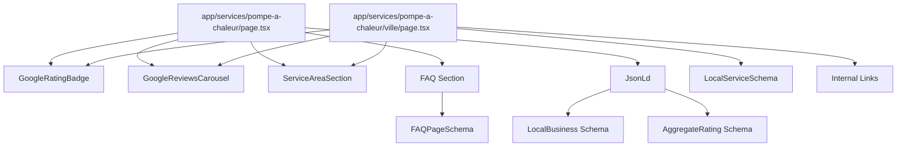

# Document de Conception — Optimisation SEO Local Greenter

## Overview

Cette conception détaille l'implémentation de l'optimisation SEO local pour le site Greenter. L'architecture s'appuie sur Next.js 14+ App Router avec Server Components pour le SEO, et utilise les composants existants (Embla Carousel, Lucide icons).

**Objectifs techniques** :
- Intégrer l'API Google Places (New) avec cache côté serveur
- Créer des composants réutilisables pour les avis Google
- Mettre à jour les schemas JSON-LD pour le ciblage local
- Structurer les pages locales avec routes dynamiques

**Stack technique** :
- Next.js 14+ App Router
- TypeScript
- Tailwind CSS
- Embla Carousel (déjà installé)
- Lucide React (déjà installé)

## Architecture

```
┌─────────────────────────────────────────────────────────────────┐
│                        Frontend (Next.js)                        │
├─────────────────────────────────────────────────────────────────┤
│  Pages                                                           │
│  ├── app/services/pompe-a-chaleur/page.tsx (mise à jour)        │
│  ├── app/services/pompe-a-chaleur/[ville]/page.tsx (nouveau)    │
│  └── app/services/pompe-a-chaleur/layout.tsx (mise à jour)      │
├─────────────────────────────────────────────────────────────────┤
│  Components                                                      │
│  ├── GoogleRatingBadge.tsx (Server Component)                   │
│  ├── GoogleReviewsCarousel.tsx (Client Component)               │
│  ├── ServiceAreaSection.tsx (Server Component)                  │
│  └── JsonLd.tsx (mise à jour)                                   │
├─────────────────────────────────────────────────────────────────┤
│  API Routes                                                      │
│  └── app/api/google-reviews/route.ts                            │
├─────────────────────────────────────────────────────────────────┤
│  Lib                                                             │
│  ├── lib/google-places.ts (utilitaires API)                     │
│  └── lib/local-seo-data.ts (données centralisées)               │
└─────────────────────────────────────────────────────────────────┘
                              │
                              ▼
┌─────────────────────────────────────────────────────────────────┐
│                    Google Places API (New)                       │
│  Endpoint: https://places.googleapis.com/v1/places/{placeId}    │
│  Cache: Next.js revalidate (86400s = 24h)                       │
└─────────────────────────────────────────────────────────────────┘
```

## Components and Interfaces

### 1. Google Reviews API Route

**Fichier** : `app/api/google-reviews/route.ts`

```typescript
// Types pour l'API Google Places (New)
interface GooglePlaceReview {
  name: string
  relativePublishTimeDescription: string
  rating: number
  text: {
    text: string
    languageCode: string
  }
  authorAttribution: {
    displayName: string
    uri: string
    photoUri: string
  }
  publishTime: string
}

interface GooglePlaceDetails {
  rating: number
  userRatingCount: number
  reviews: GooglePlaceReview[]
}

// Response de notre API
interface GoogleReviewsResponse {
  rating: number
  reviewCount: number
  reviews: {
    authorName: string
    authorPhoto: string
    rating: number
    text: string
    relativeTime: string
    publishTime: string
  }[]
  googleMapsUrl: string
  writeReviewUrl: string
}
```

**Implémentation** :
- Utilise `fetch` avec `next: { revalidate: 86400 }` pour le cache 24h
- Appelle Google Places API (New) avec le Place ID configuré
- Transforme la réponse en format simplifié pour le frontend
- Gère les erreurs avec fallback sur données en cache

### 2. Google Rating Badge Component

**Fichier** : `components/GoogleRatingBadge.tsx`

```typescript
interface GoogleRatingBadgeProps {
  className?: string
}
```

**Comportement** :
- Server Component pour le SEO (données récupérées côté serveur)
- Affiche la note moyenne avec étoiles visuelles
- Affiche le nombre d'avis
- Logo Google officiel (SVG inline)
- Lien vers la fiche Google Maps au clic

**Design** :
- Badge compact avec fond blanc/gris clair
- Étoiles jaunes (#FBBC04)
- Texte "4.8/5 (23 avis)"
- Hover effect subtil

### 3. Google Reviews Carousel Component

**Fichier** : `components/GoogleReviewsCarousel.tsx`

```typescript
interface GoogleReviewsCarouselProps {
  className?: string
  autoplayDelay?: number // défaut: 5000ms
}
```

**Comportement** :
- Client Component (pour les animations Embla)
- Récupère les données via l'API interne `/api/google-reviews`
- Défilement automatique avec pause au hover
- Affiche 1 avis sur mobile, 2-3 sur desktop

**Structure d'un avis** :
- Photo de profil (ou initiale)
- Nom du client
- Note en étoiles
- Texte de l'avis (tronqué si > 200 caractères)
- Date relative ("il y a 2 semaines")

**Liens** :
- "Voir tous nos avis" → Google Maps
- "Laisser un avis" → URL d'écriture d'avis Google

### 4. Service Area Section Component

**Fichier** : `components/ServiceAreaSection.tsx`

```typescript
interface ServiceAreaSectionProps {
  title?: string // défaut: "Nous intervenons près de chez vous"
  showCTA?: boolean // défaut: true
  className?: string
}
```

**Comportement** :
- Server Component
- Affiche la liste des villes depuis `lib/local-seo-data.ts`
- Grille responsive (2 colonnes mobile, 4 colonnes desktop)
- Checkmarks verts devant chaque ville

### 5. Updated JsonLd Component

**Fichier** : `components/JsonLd.tsx`

**Modifications** :
- Adresse : Ozoir-la-Ferrière, 77330
- Coordonnées GPS : 48.7626, 2.6721
- `areaServed` : Liste des villes au lieu de "Country: France"
- Ajout de `aggregateRating` avec données dynamiques

```typescript
// Structure areaServed mise à jour
areaServed: [
  { "@type": "City", "name": "Ozoir-la-Ferrière" },
  { "@type": "City", "name": "Roissy-en-Brie" },
  // ...
]

// Structure aggregateRating
aggregateRating: {
  "@type": "AggregateRating",
  "ratingValue": "4.8",
  "reviewCount": "23",
  "bestRating": "5",
  "worstRating": "1"
}
```

### 6. Local SEO Data Configuration

**Fichier** : `lib/local-seo-data.ts`

```typescript
export interface City {
  name: string
  slug: string
  postalCode: string
  department: string
}

export interface ServiceInfo {
  name: string
  slug: string
  shortDescription: string
}

export const CITIES: City[] = [
  { name: "Ozoir-la-Ferrière", slug: "ozoir-la-ferriere", postalCode: "77330", department: "Seine-et-Marne" },
  { name: "Roissy-en-Brie", slug: "roissy-en-brie", postalCode: "77680", department: "Seine-et-Marne" },
  // ...
]

export const SERVICES: ServiceInfo[] = [
  { name: "Pompe à chaleur", slug: "pompe-a-chaleur", shortDescription: "Installation PAC air-eau et air-air" },
  // ...
]

export const GOOGLE_PLACE_ID = "ChIJ18W1Jb2UBkgRQ0A08rwoyGU"
export const GOOGLE_MAPS_URL = `https://www.google.com/maps/place/?q=place_id:${GOOGLE_PLACE_ID}`
export const GOOGLE_REVIEW_URL = `https://search.google.com/local/writereview?placeid=${GOOGLE_PLACE_ID}`

export const COMPANY_ADDRESS = {
  locality: "Ozoir-la-Ferrière",
  postalCode: "77330",
  country: "FR",
  latitude: 48.7626,
  longitude: 2.6721
}
```

### 7. Local Page Template

**Fichier** : `app/services/pompe-a-chaleur/[ville]/page.tsx`

```typescript
interface LocalPageProps {
  params: { ville: string }
}

// generateStaticParams pour les villes prioritaires
export async function generateStaticParams() {
  return CITIES.map(city => ({ ville: city.slug }))
}

// generateMetadata pour les meta tags dynamiques
export async function generateMetadata({ params }: LocalPageProps): Promise<Metadata> {
  const city = CITIES.find(c => c.slug === params.ville)
  return {
    title: `Installation Pompe à Chaleur ${city?.name} | Devis Gratuit | Greenter`,
    description: `Installation de pompe à chaleur à ${city?.name} (${city?.postalCode}). Certifié RGE. Jusqu'à 70% d'économies. Devis gratuit sous 48h. ☎ 06 09 45 50 56`,
    // ...
  }
}
```

## Data Models

### Google Reviews Cache Structure

```typescript
// Stocké dans le cache Next.js via revalidate
interface CachedGoogleReviews {
  rating: number
  reviewCount: number
  reviews: Review[]
  fetchedAt: string // ISO date
}

interface Review {
  authorName: string
  authorPhoto: string | null
  rating: number
  text: string
  relativeTime: string
  publishTime: string
}
```

### Local FAQ Data

```typescript
interface LocalFAQ {
  question: string
  answer: string
  cities?: string[] // Si spécifique à certaines villes
}

const LOCAL_FAQS: LocalFAQ[] = [
  {
    question: "Combien coûte une pompe à chaleur à Ozoir-la-Ferrière ?",
    answer: "Le prix d'une pompe à chaleur à Ozoir-la-Ferrière varie entre 8 000€ et 18 000€ selon le modèle. Avec MaPrimeRénov' et les CEE, le reste à charge peut être réduit de 40 à 70%. Contactez-nous pour un devis personnalisé gratuit.",
    cities: ["ozoir-la-ferriere"]
  },
  {
    question: "Quelles aides pour une PAC en Seine-et-Marne ?",
    answer: "En Seine-et-Marne (77), vous pouvez bénéficier de MaPrimeRénov' (jusqu'à 5 000€), des primes CEE (jusqu'à 4 000€), de la TVA réduite à 5,5%, et de l'éco-PTZ. Greenter vous accompagne dans toutes vos démarches."
  },
  {
    question: "Intervenez-vous à Roissy-en-Brie ?",
    answer: "Oui, Greenter intervient à Roissy-en-Brie et dans toute la Seine-et-Marne : Ozoir-la-Ferrière, Chevry-Cossigny, Lésigny, Pontault-Combault, Gretz-Armainvilliers, Tournan-en-Brie, Brie-Comte-Robert. Devis gratuit sous 48h."
  }
]
```


## Correctness Properties

*A property is a characteristic or behavior that should hold true across all valid executions of a system—essentially, a formal statement about what the system should do. Properties serve as the bridge between human-readable specifications and machine-verifiable correctness guarantees.*

### Property 1: API Response Structure Validation

*For any* successful call to `/api/google-reviews`, the response SHALL contain a valid JSON object with `rating` (number between 1-5), `reviewCount` (positive integer), and `reviews` (array of review objects each containing authorName, rating, text, and relativeTime).

**Validates: Requirements 1.1, 1.3**

### Property 2: Rating Badge Rendering

*For any* rating value between 1 and 5, the GoogleRatingBadge component SHALL render the rating in "X.X/5" format and display a number of filled stars proportional to the rating value (e.g., rating 4.5 shows 4.5 filled stars).

**Validates: Requirements 2.1, 2.3**

### Property 3: Review Card Rendering

*For any* review object with authorName, rating, text, and relativeTime, the GoogleReviewsCarousel SHALL render a card containing all four fields visibly.

**Validates: Requirements 3.2**

### Property 4: Schema areaServed Structure

*For any* generated LocalBusiness schema, the `areaServed` field SHALL be an array where each element has `@type: "City"` and a `name` property containing a valid city name from the configured list.

**Validates: Requirements 4.3, 4.5**

### Property 5: FAQPageSchema Completeness

*For any* FAQ section rendered on the PAC page, the FAQPageSchema SHALL contain exactly the same questions as displayed in the UI, with matching question text and answer text.

**Validates: Requirements 8.4**

### Property 6: Local Page Generation Consistency

*For any* valid city slug from the configured cities list, the local page at `/services/pompe-a-chaleur/[ville]` SHALL:
- Render content containing the city name
- Generate metadata with title containing the city name
- Include a Service schema with areaServed matching that specific city

**Validates: Requirements 9.2, 9.3, 9.4**

### Property 7: Sitemap Local Pages Coverage

*For any* city in the configured priority cities list, the sitemap SHALL contain a URL entry for `/services/pompe-a-chaleur/[city-slug]` with priority 0.8 and changeFrequency "monthly".

**Validates: Requirements 9.5**

### Property 8: Internal Linking on Local Pages

*For any* local page rendered for a city, the page SHALL contain:
- Links to other services available in the same city
- Links to the same service in at least 2 neighboring cities from the configured list

**Validates: Requirements 11.2, 11.3**

## Error Handling

### API Error Handling

| Error Type | Handling Strategy |
|------------|-------------------|
| Google API rate limit | Return cached data if available, else 503 with retry-after header |
| Google API authentication error | Log error, return 500 with generic message |
| Invalid Place ID | Return 400 with descriptive error |
| Network timeout | Return cached data if available, else 504 |
| Malformed API response | Log error, return 500, use fallback data |

### Component Error Handling

| Component | Error Scenario | Fallback |
|-----------|----------------|----------|
| GoogleRatingBadge | No data available | Hide component or show placeholder |
| GoogleReviewsCarousel | Empty reviews array | Hide carousel section |
| ServiceAreaSection | Empty cities list | Show default message |
| Local Page | Invalid city slug | Return 404 page |

### Schema Fallbacks

```typescript
// Default values when Google Reviews API fails
const DEFAULT_RATING_DATA = {
  rating: 4.8,
  reviewCount: 20,
  reviews: []
}
```

## Testing Strategy

### Unit Tests

Unit tests focus on specific examples and edge cases:

1. **API Route Tests**
   - Test response format with mocked Google API
   - Test error handling with various failure scenarios
   - Test cache behavior (mock Next.js cache)

2. **Component Tests**
   - Test GoogleRatingBadge renders correctly with sample data
   - Test GoogleReviewsCarousel handles empty reviews
   - Test ServiceAreaSection renders all cities
   - Test JsonLd generates valid JSON-LD

3. **Schema Tests**
   - Test LocalBusiness schema structure
   - Test AggregateRating schema values
   - Test FAQPageSchema matches FAQ content

### Property-Based Tests

Property-based tests use `fast-check` (already installed) to verify universal properties:

**Configuration**: Minimum 100 iterations per property test

1. **Property 1 Test**: Generate random valid API responses, verify structure
2. **Property 2 Test**: Generate random ratings (1-5), verify star rendering
3. **Property 3 Test**: Generate random review objects, verify card rendering
4. **Property 4 Test**: Generate schema, verify areaServed structure
5. **Property 5 Test**: Generate FAQ items, verify schema completeness
6. **Property 6 Test**: Generate city slugs, verify page generation
7. **Property 7 Test**: Generate city list, verify sitemap coverage
8. **Property 8 Test**: Generate local pages, verify internal links

**Test Tagging Format**:
```typescript
// Feature: seo-local-optimization, Property 1: API Response Structure Validation
```

### Integration Tests

- Test full flow: API call → Component render → Schema generation
- Test sitemap generation includes all local pages
- Test internal linking between pages

## Mermaid Diagrams

### Data Flow Diagram

```mermaid
flowchart TD
    subgraph Client
        A[Page Request] --> B[Server Component]
        B --> C[GoogleRatingBadge]
        B --> D[GoogleReviewsCarousel]
    end
    
    subgraph Server
        C --> E[/api/google-reviews]
        D --> E
        E --> F{Cache Valid?}
        F -->|Yes| G[Return Cached Data]
        F -->|No| H[Call Google Places API]
        H --> I[Transform Response]
        I --> J[Cache Response]
        J --> G
    end
    
    subgraph External
        H --> K[Google Places API]
        K --> H
    end
```

### Component Hierarchy



### Local Page Generation Flow

```mermaid
flowchart LR
    A[lib/local-seo-data.ts] --> B[Cities Config]
    B --> C[generateStaticParams]
    C --> D[/services/pompe-a-chaleur/ozoir-la-ferriere]
    C --> E[/services/pompe-a-chaleur/roissy-en-brie]
    C --> F[/services/pompe-a-chaleur/...]
    
    B --> G[generateMetadata]
    G --> H[Dynamic Title/Description]
    
    B --> I[sitemap.ts]
    I --> J[XML Sitemap]
